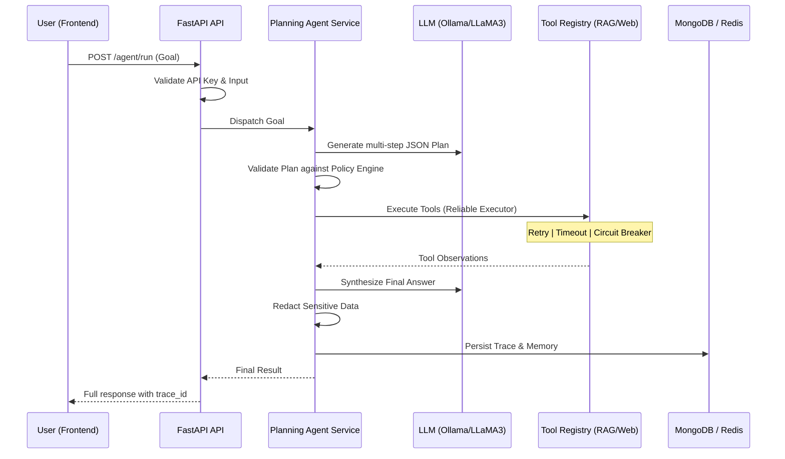

<p align="center">
  <h1 align="center">🚀 Enterprise AI Agent Engine</h1>
  <p align="center">
    <strong>A production-grade, modular AI agent backend with multi-step planning, intelligent tool routing, RAG, and extreme reliability.</strong>
  </p>
  <p align="center">
    
    
    
    
    
    
  </p>
</p>

---

## 📖 Table of Contents
- [Overview](#overview)
- [System Use Cases](#system-use-cases)
- [Architecture & Flow](#architecture--flow)
- [What Has Been Done (Backend Milestone)](#what-has-been-done-backend-milestone)
- [The Production Stack](#the-production-stack)
- [Project Structure](#project-structure)
- [Backend Execution Guide](#backend-execution-guide)
- [Frontend Handoff](#frontend-handoff)
- [Next Steps](#next-steps)

---

## Overview
The **Enterprise AI Agent Engine** is a high-performance backend designed to orchestrate complex user goals into actionable, multi-step execution plans. Unlike simple wrappers, this engine independently manages tool selection, handles failures with **Circuit Breakers**, follows strict **Security Policies**, and maintains context through a hybrid **Semantic Memory** system.

### Why this project is useful:
- **Autonomous Problem Solving**: It doesn't just chat; it *acts*. It plans, searches, retrieves, and synthesizes.
- **Enterprise Reliability**: Built-in protection against LLM or Tool downtime.
- **Extreme Transparency**: Every step of the agent's thought process is traced and stored.
- **Scalable Design**: Uses an asynchronous stack ready for horizontal scaling via Celery and Docker.

---

## System Use Cases
- **Technical Knowledge Assistant**: Query vast enterprise documentation using the integrated RAG pipeline.
- **Automated Research Agent**: Combine local knowledge with real-time web search for comprehensive market/tech research.
- **Secure Customer Support**: A sandbox-environment agent that follows tool whitelists and redacts sensitive data automatically.

---

## Architecture & Flow

### High-Level Execution Flow
The following diagram illustrates the lifecycle of a single user request through the system:



---

## What Has Been Done (Backend Milestone)
We have successfully completed the core backend infrastructure and production hardening.

| Priority | Feature | Status |
|---|---|---|
| **1** | **Testing Suite** | 54+ tests verifying guardrails, routing, and agent logic. |
| **2** | **Resilience** | Circuit Breakers wired into LLM and Web Search tools. |
| **3** | **Security** | Policy Engine with tool whitelisting and PII redaction. |
| **4** | **RAG Strategy** | Recursive document crawler and vector store builder script. |
| **5** | **DevOps** | Robust healthchecks, non-root Docker builds, and Readiness probes. |
| **6** | **Secrets** | Unified environment validation guards and centralized `.env` management. |
| **7** | **Observability**| Prometheus metrics for request latency and tool success rates. |
| **8** | **Simulation** | Scripts to stress-test failure scenarios and system recovery. |
| **9** | **Linting** | Enforced quality checks via `flake8` and security scans via `bandit`. |
| **10**| **Validation** | Final production-readiness validator script. |
| **11**| **Handoff** | Complete documentation and React SDK for the frontend team. |

---

## The Production Stack
- **API**: FastAPI (Asynchronous)
- **LLM**: Ollama (Local) with LLaMA3-8B-Instruct
- **Vector DB**: Local Vector Store with `sentence-transformers`
- **Primary DB**: MongoDB 7.0 (Traces, Memory, Cache)
- **Message Broker**: Redis 7.0 (Celery Task Queue)
- **Monitoring**: Prometheus
- **Deployment**: Docker & Docker Compose

---

## Project Structure
```text
/genai-agent-sprint
├── app/                  # Core Engine
│   ├── services/         # Planning, Embeddings, Retrieval
│   ├── infrastructure/   # Circuit Breakers, Reliable Executors, Logging (Prometheus)
│   ├── security/         # Policy Engine, Guardrails (Input/Output validation)
│   ├── tools/            # RAG Search, Web Search (SerpAPI)
│   └── api_app.py        # Master FastAPI Entrypoint
├── data/                 # Knowledge Base (Technical Docs + Vector Store)
├── scripts/              # DevOps: Validator, Mock Generator, Vector Builder
├── tests/                # 54+ Unit & Integration Tests
├── frontend-handoff/     # Assets for UI development
└── docker-compose.yml    # Full system orchestration
```

---

## Backend Execution Guide

### 1. Prerequisites
- **Python 3.11+**
- **Ollama** (Running `llama3:8b-instruct-q4_K_M`)
- **Docker Desktop** (For MongoDB & Redis)

### 2. Quick Start (Terminal Commands)

**Step A: Setup Environment**
```bash
pip install -r requirements.txt
cp .env.example .env  # Update with your SERPAPI_KEY and API_KEY
```

**Step B: Build Knowledge Base**
```bash
python scripts/build_vector_store.py
```

**Step C: Start Backend Services**
```bash
docker-compose up -d  # Starts Mongo, Redis, and API in Background
```

**Step D: Verify Production Readiness**
```bash
python scripts/validate_prod_ready.py
```

**✅ Check:** Visit `http://localhost:8000/health` to confirm the system is active.

---

## Frontend Handoff
While the frontend is **yet to start**, everything is prepared:
- **OpenAPI Spec**: Available at `frontend-handoff/openapi.json`.
- **React Client**: Pre-built TS SDK with polling logic in `frontend-handoff/client/`.
- **Postman**: Import `frontend-handoff/postman_collection.json` to test immediately.

---

## Next Steps
- [ ] Initialize React/Vite Frontend
- [ ] Implement Agent Chat UI
- [ ] Integrate Trace Visualization Component
- [ ] Deploy to Cloud Infrastructure (Staging)

---

<p align="center">
  <sub>Built for scale and reliability. Ready for the next phase.</sub>
</p>
