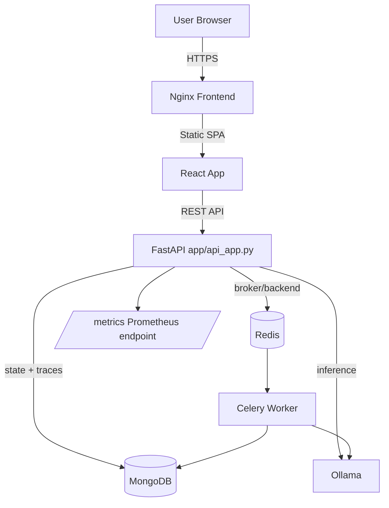
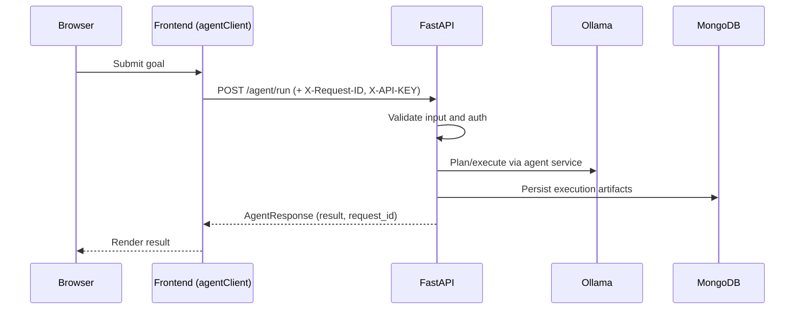
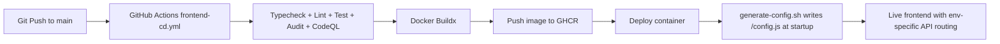

# GenAI Agent Platform

Enterprise-grade reference implementation for an agentic AI platform with a FastAPI backend, React control plane, Redis/Celery async execution, MongoDB memory, and Nginx-based frontend delivery.

## 1. Executive Summary

This repository contains two primary runtime surfaces:
- Backend API and orchestration: `app/api_app.py`
- Frontend SPA and gateway: `frontend/` (Vite + React + Nginx)

It is designed to support:
- Tool-augmented agent execution (`/agent/run`)
- Health/readiness/metrics for operations
- Runtime-configurable frontend deployment via `config.js`
- Containerized deployment with GitHub Actions CD for frontend images

## 2. Architecture

### 2.1 System Topology



### 2.2 Request and Execution Flow



## 3. Repository Structure

```text
genai-agent-sprint/
  .github/workflows/           # CI/CD workflows
  api/                         # Alternate API entrypoints/schemas
  app/                         # Primary backend runtime code
    api/                       # API routers
    observability/             # /health and /ready routers
    infra/                     # Retry/timeout/logging/celery/ollama integration
    memory/                    # MongoDB adapter and models
    services/                  # Agent, planning, retrieval, memory services
    tools/                     # Tool implementations (RAG, web search)
    api_app.py                 # Production backend entrypoint
  frontend/                    # React SPA + Nginx container config
  scripts/                     # Utility scripts (validation, config generation, etc.)
  tests/                       # Backend test suite
  docker-compose.yml           # Local infra and app orchestration
  Dockerfile                   # Backend image build
```

## 4. Backend Runtime

### 4.1 Production Entrypoint

- File: `app/api_app.py`
- Exposes:
  - `GET /` service metadata
  - `GET /health`
  - `GET /ready`
  - `POST /agent/run`
  - `GET /metrics` (Prometheus ASGI mount)

### 4.2 Startup Dependency Gates

At startup, backend validates critical environment variables and dependencies:
- Required env vars: `API_KEY`, `SERPAPI_KEY`, `HF_TOKEN`, `MONGO_URI`, `OLLAMA_HOST`
- Connectivity checks include Mongo initialization and index creation

### 4.3 Security and Validation

- API key verification on protected agent endpoints
- Goal input validation through `app/infra/validators.py`
- Request size guard exists in `api/app.py` for alternate entrypoint

## 5. Frontend Runtime

### 5.1 Agent Client Hardening

`frontend/src/features/agent/api/agentClient.ts` includes:
- Per-request `X-Request-ID` generation
- Runtime-configurable refresh endpoint (`REFRESH_ENDPOINT`)
- Telemetry abstraction using `navigator.sendBeacon` when configured
- 401 refresh queue handling to prevent token refresh storms

### 5.2 Runtime Config Injection

- Frontend reads `window.__APP_CONFIG__` from `/config.js`
- `index.html` loads `/config.js` before app bootstrap
- `scripts/generate-config.sh` emits deployment-specific config without rebuild

### 5.3 Nginx Hardening

`frontend/nginx.conf` provides:
- Rate limiting (`10r/s`, burst `20`)
- SPA routing fallback (`try_files ... /index.html`)
- Security headers (`X-Frame-Options`, `X-Content-Type-Options`, CSP)
- Health endpoints (`/healthz`, `/ready`)
- Asset cache policy and gzip compression
- HTTPS template block with HSTS and TLS 1.2/1.3 settings

## 6. CI/CD (Frontend)

Workflow: `.github/workflows/frontend-cd.yml`

Pipeline stages:
1. Checkout
2. CodeQL init
3. Node setup with npm cache
4. Install (`npm ci`)
5. Type check
6. Lint
7. Tests
8. Build
9. `npm audit --audit-level=moderate` (blocking)
10. Upload build artifact
11. CodeQL analyze
12. GHCR login (non-PR)
13. Docker Buildx build and push with GitHub Actions cache

Images are tagged:
- `ghcr.io/<owner>/genai-agent-frontend:<sha>`
- `ghcr.io/<owner>/genai-agent-frontend:latest`

## 7. Complete Execution Process

### 7.1 Prerequisites

- Python 3.11+
- Node.js 20+
- Docker + Docker Compose
- Ollama running and reachable from backend

### 7.2 Environment Setup

```bash
cp .env.example .env
```

Populate sensitive values in `.env`:
- `API_KEY`
- `SERPAPI_KEY`
- `HF_TOKEN`
- `MONGO_URI`
- `OLLAMA_HOST`

### 7.3 Local Infrastructure

```bash
docker compose up -d mongo redis
```

### 7.4 Backend Local Run

```bash
pip install -r requirements.txt
uvicorn app.api_app:app --host 0.0.0.0 --port 8000 --reload
```

Alternative production-style run:

```bash
gunicorn app.api_app:app -k uvicorn.workers.UvicornWorker -w 1 -b 0.0.0.0:8000 --timeout 120
```

### 7.5 Frontend Local Run

```bash
cd frontend
npm ci
npm run dev
```

### 7.6 Generate Runtime Config

```bash
API_BASE=http://localhost:8000 APP_VERSION=local-dev ./scripts/generate-config.sh > frontend/public/config.js
```

### 7.7 Frontend Container Build and Run

```bash
docker build -t genai-frontend:local ./frontend
docker run --rm -p 8080:80 \
  -e API_BASE=http://host.docker.internal:8000 \
  -e APP_VERSION=local \
  genai-frontend:local
```

### 7.8 Full Stack with Compose

```bash
docker compose up -d
```

## 8. Deployment Diagram



## 9. Verification and Acceptance

Run these after deployment:

```bash
nginx -t
curl -I https://<your-domain>
curl -i https://<your-domain>/ready
curl -i https://<your-domain>/healthz
curl -i https://<your-domain>/config.js
docker buildx build --tag ghcr.io/<org>/genai-agent-frontend:local --load ./frontend
```

Expected checks:
- `Strict-Transport-Security` appears on HTTPS responses
- CSP header present
- `/ready` and `/healthz` return HTTP 200 from frontend gateway
- `/config.js` served as `application/javascript`

## 10. Testing and Quality Gates

### Backend

```bash
pytest -q
```

### Frontend

```bash
cd frontend
npm run lint
npm run test -- --run
npm run build
```

## 11. Operations and Monitoring

### 11.1 Health and Readiness

- Backend health: `GET /health`
- Backend readiness: `GET /ready`
- Frontend probe endpoints: `/healthz`, `/ready`

### 11.2 Metrics

- Prometheus scrape endpoint: `GET /metrics`

### 11.3 Logs

```bash
docker logs genai-api -f
docker logs genai-worker -f
docker logs genai-mongo -f
docker logs genai-redis -f
```

## 12. Security Controls Summary

- API key verification on agent execution routes
- Nginx rate limiting and secure headers
- TLS + HSTS template for production
- Blocking dependency audit in CI
- CodeQL static analysis in CI
- Runtime config injection to avoid secret baking into static assets

## 13. Known Gaps and Integration Notes

- Frontend currently contains calls for `/api/agents`, `/api/runs`, and `/traces/{requestId}` in `agentClient.ts`; ensure backend routes are implemented or feature-gated before production cutover.
- `index.html` includes a CSP meta tag for dev; in production, prefer enforcing CSP via Nginx headers only.
- Enable Brotli directives in Nginx only when module support is present in the image.

## 14. Release Checklist

- [ ] Secrets configured in deployment environment
- [ ] `.env` values validated in staging
- [ ] Backend startup gates pass
- [ ] Frontend CI pipeline green on `main`
- [ ] Image pushed to GHCR with SHA tag
- [ ] `config.js` generated at runtime with production API base
- [ ] Nginx HTTPS block configured with real certificate paths and domain
- [ ] Post-deploy verification commands pass

## 15. Key Files Reference

- Backend entrypoint: `app/api_app.py`
- Frontend API client: `frontend/src/features/agent/api/agentClient.ts`
- Frontend Nginx config: `frontend/nginx.conf`
- Frontend Docker image build: `frontend/Dockerfile`
- Runtime config script: `scripts/generate-config.sh`
- Frontend CD workflow: `.github/workflows/frontend-cd.yml`
- Local orchestration: `docker-compose.yml`

---

This README is intentionally implementation-aligned so platform, security, and operations teams can execute the same runbook across local, staging, and production environments.

