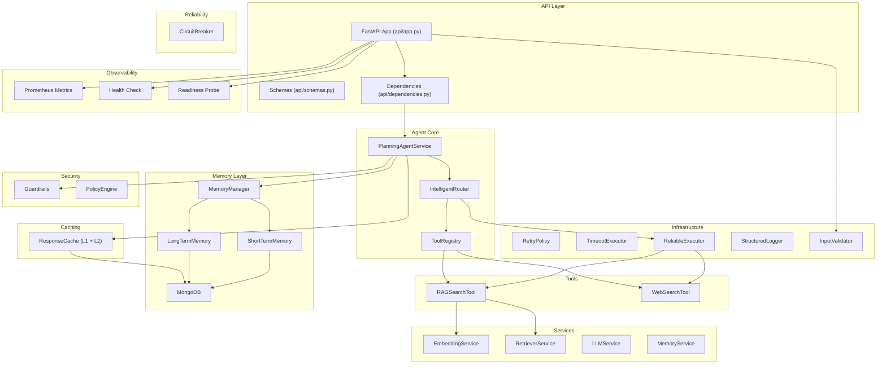

# GenAI & Agentic AI — Enterprise AI Agent Engine

## Project Overview

**Project Name:** `genai-agent-sprint`  
**Status:** Active — API server running (`uvicorn api.app:app --reload`)

An **enterprise-grade, production-ready AI Agent Backend** built from scratch. It is **not** a simple chatbot — it's a modular AI system with planning, tool execution, memory, caching, security guardrails, observability, and reliability layers.

---

## Tech Stack

| Layer | Technology |
|---|---|
| **Language** | Python 3.11 |
| **API Framework** | FastAPI + Uvicorn |
| **LLM** | Ollama (LLaMA3 8B Instruct, local) |
| **Embeddings** | HuggingFace `sentence-transformers` via `transformers` |
| **Vector Search** | Custom vector store (NumPy cosine similarity) |
| **Database** | MongoDB (async via `motor`) |
| **Web Search** | SerpAPI (Google) |
| **Metrics** | Prometheus (`prometheus_client`) |
| **Containerization** | Docker (multi-stage build) |
| **Config** | `python-dotenv` + `.env` file |

---

## Architecture Diagram



---

## What Has Been Built (Feature Breakdown)

### ✅ 1. FastAPI REST API
- **POST `/agent/run`** — Main agent endpoint (accepts goal, returns AI response)
- **GET `/health`** — Liveness check
- **GET `/ready`** — Database readiness probe
- **GET `/metrics`** — Prometheus metrics endpoint
- **GET `/traces/{request_id}`** — Trace debugging endpoint
- API key authentication via `X-API-Key` header
- Request size limiting middleware (413 protection)
- Pydantic-validated request/response schemas

### ✅ 2. Planning Agent (Core Brain)
- LLM-powered plan generation using Ollama/LLaMA3
- JSON plan parsing with retry logic (up to 2 retries)
- Multi-step plan execution with parallel step support
- Final answer synthesis from observations + memory context
- Memory-aware responses (uses conversation history)

### ✅ 3. Intelligent Router
- Tool resolution from registry
- Primary execution via `ReliableExecutor`
- **Failure-based fallback:** auto-falls back to `web_search` if primary tool errors
- **Confidence-based fallback:** if RAG similarity score < threshold (0.50), auto-falls back to web search
- Full structured logging at every decision point

### ✅ 4. Tool System
- **`BaseTool`** abstract interface (`tools.py`)
- **`RAGSearchTool`** — Vector similarity search over local documents
- **`WebSearchTool`** — Live Google search via SerpAPI
- **`ToolRegistry`** — Dynamic tool registration and lookup

### ✅ 5. RAG Pipeline (Retrieval-Augmented Generation)
- Text chunking from `data/sample.txt`
- Embedding generation via `sentence-transformers`
- Persistent vector store (`data/vector_store.pkl`)
- Cosine similarity search with confidence scores
- Top-K retrieval with score metadata

### ✅ 6. Enterprise Memory System
- **`MemoryManager`** — Coordinates short-term + long-term memory
- **`ShortTermMemory`** — Recent conversation messages (MongoDB)
- **`LongTermMemory`** — Semantic memory with embedding-based retrieval (MongoDB)
- **`MongoDB`** — Singleton async client with index initialization
- Session-based memory isolation

### ✅ 7. Smart Response Cache (L1 + L2)
- **L1:** In-memory process-level cache with TTL
- **L2:** MongoDB-backed persistent cache with auto-expiry indexes
- SHA-256 hash-based cache keys (goal-level + plan-level)
- Cache hit/miss tracking

### ✅ 8. Security & Guardrails
- **Prompt Injection Detection** — 13 regex patterns (e.g., "ignore previous instructions")
- **Plan Validation** — Max steps, tool whitelist, query length limits
- **Tool Output Sanitization** — Blocks malicious patterns (e.g., "exfiltrate", "system override")
- **Memory Poisoning Protection** — Detects "from now on..." style attacks
- **Final Answer Leak Detection** — Blocks API keys, passwords, secrets leakage
- **Input Validator** — Schema-based validation (length, type, sanitization)

### ✅ 9. Reliability Layer
- **`RetryPolicy`** — Exponential backoff retry (configurable retries, delay, factor)
- **`TimeoutExecutor`** — Async timeout enforcement (10s default)
- **`ReliableExecutor`** — Combines retry + timeout into one wrapper
- **`CircuitBreaker`** — State machine (CLOSED → OPEN → HALF_OPEN) with failure threshold, recovery timeout, and execution timeout

### ✅ 10. Observability
- **Prometheus Metrics** — Request count, cache hits, active requests, planner/tool/synthesis latency histograms
- **Health Endpoint** — Checks MongoDB + Ollama connectivity
- **Readiness Probe** — MongoDB ping check (K8s-ready)
- **Trace Storage** — Full execution traces stored in MongoDB (steps, observations, latencies)
- **Trace Evaluation Script** — Analyzes traces for tool usage stats, success rates, p95 latencies

### ✅ 11. Docker Deployment
- Multi-stage Dockerfile (builder + runtime)
- Production server: Gunicorn + Uvicorn workers (3 workers)
- `.dockerignore` configured
- Port 8000 exposed

### ✅ 12. CLI Entrypoints
- `app/main.py` — Interactive CLI with RAG + memory (early version)
- `app/planning_agent_main.py` — Enterprise CLI with full planning + routing

### ✅ 13. Learning Documentation
- 8 PDF revision notes covering Days 1–12 of the learning sprint (in `assets/`)

---

## Folder Structure (Complete)

```
genai-agent-sprint/
│
├── .env                          # Environment variables (API keys, MongoDB URI, model config)
├── .gitignore                    # Git ignore rules
├── .dockerignore                 # Docker ignore rules
├── Dockerfile                    # Multi-stage Docker build (Python 3.11-slim)
├── requirements.txt              # Python dependencies
├── README.md                     # Project README
│
├── api/                          # ── FastAPI REST Layer ──
│   ├── __init__.py
│   ├── app.py                    # FastAPI app, endpoints, middleware, API key auth
│   ├── dependencies.py           # Dependency injection (wires all components together)
│   └── schemas.py                # Pydantic request/response models
│
├── app/                          # ── Core Application ──
│   ├── __init__.py
│   ├── main.py                   # CLI entrypoint (basic RAG + memory loop)
│   ├── agent.py                  # Agent module
│   ├── agent_main.py             # Simple agent runner
│   ├── planning_agent_main.py    # Enterprise CLI entrypoint (planning + routing)
│   ├── rag.py                    # RAG module
│   ├── llm_test.py               # LLM testing script
│   ├── utils.py                  # Utility functions
│   │
│   ├── config/                   # ── Configuration ──
│   │   └── settings.py           # Central settings (env-based: model, thresholds, timeouts)
│   │
│   ├── core/                     # ── Core Components ──
│   │   ├── __init__.py
│   │   └── vector_store.py       # Vector store (chunking, embedding, persistence)
│   │
│   ├── services/                 # ── Business Logic Services ──
│   │   ├── __init__.py
│   │   ├── planning_agent_service.py  # Planning agent (plan → execute → synthesize) [522 lines]
│   │   ├── agent_service.py      # Basic agent service
│   │   ├── embedding_service.py  # Sentence-transformer embedding generation
│   │   ├── retriever_service.py  # Vector retrieval service
│   │   ├── llm_service.py        # Ollama LLM wrapper
│   │   └── memory_service.py     # In-memory conversation memory
│   │
│   ├── tools/                    # ── Agent Tools ──
│   │   ├── __init__.py
│   │   ├── tools.py              # BaseTool abstract interface
│   │   ├── rag_search_tool.py    # RAG vector search tool (cosine similarity)
│   │   └── web_search_tool.py    # Web search tool (SerpAPI / Google)
│   │
│   ├── routing/                  # ── Intelligent Router ──
│   │   ├── __init__.py
│   │   └── intelligent_router.py # Execution routing with fallback logic
│   │
│   ├── registry/                 # ── Tool Registry ──
│   │   ├── __init__.py
│   │   └── tool_registry.py      # Dynamic tool registration and lookup
│   │
│   ├── memory/                   # ── Enterprise Memory System ──
│   │   ├── models.py             # Memory data models
│   │   ├── database.py           # MongoDB singleton (async motor client + indexes)
│   │   ├── memory_manager.py     # Unified memory coordinator
│   │   ├── short_term_memory.py  # Recent conversation messages (MongoDB)
│   │   └── long_term_memory.py   # Semantic long-term memory (MongoDB + embeddings)
│   │
│   ├── cache/                    # ── Response Caching ──
│   │   └── response_cache.py     # L1 in-memory + L2 MongoDB cache with TTL
│   │
│   ├── infra/                    # ── Infrastructure Layer ──
│   │   ├── __init__.py
│   │   ├── logger.py             # Structured JSON logger + Prometheus metrics export
│   │   ├── retry_policy.py       # Exponential backoff retry policy
│   │   ├── timeout_executor.py   # Async timeout enforcement
│   │   ├── reliable_executor.py  # Combined retry + timeout executor
│   │   └── validators.py         # Input validation (sanitization, length, type checks)
│   │
│   ├── security/                 # ── Security & Guardrails ──
│   │   ├── guardrails.py         # Adversarial guardrails (injection, poisoning, leakage)
│   │   ├── input_validator.py    # Schema-based input validation
│   │   └── policy_engine.py      # Security policy enforcement
│   │
│   ├── reliability/              # ── Reliability Patterns ──
│   │   └── circuit_breaker.py    # Async circuit breaker (CLOSED/OPEN/HALF_OPEN)
│   │
│   ├── observability/            # ── Monitoring & Health ──
│   │   ├── metrics.py            # Prometheus counters, histograms, gauges
│   │   ├── health.py             # Health check endpoint (MongoDB + Ollama)
│   │   └── readiness.py          # Readiness probe (database ping)
│   │
│   ├── entrypoints/              # ── Additional entrypoints (empty) ──
│   │
│   └── archive/                  # ── Archived / Earlier versions ──
│       ├── embedding_test.py     # Early embedding test
│       ├── rag_basic.py          # Basic RAG implementation (v1)
│       └── rag_persistent.py     # Persistent RAG implementation (v2)
│
├── data/                         # ── Data Files ──
│   ├── sample.txt                # Source document for RAG
│   └── vector_store.pkl          # Persisted vector embeddings
│
├── scripts/                      # ── Utility Scripts ──
│   └── evaluate_traces.py        # Trace evaluation report (latency, tool usage, success rates)
│
└── assets/                       # ── Learning Resources ──
    ├── GenAI_Day1_Detailed_Revision.pdf
    ├── Day2_RAG_Detailed_Revision.pdf
    ├── Day3_Modular_Architecture_Detailed_Revision.pdf
    ├── Day4_Memory_Layer_Detailed_Revision.pdf
    ├── Day5_Agentic_AI_Foundations_Detailed_Revision.pdf
    ├── Day6_Enterprise_Hybrid_RAG_Revision.pdf
    ├── Day7_Day12_Enterprise_Agent_Notes.pdf
    └── Day8_Enterprise_Memory_System_Revision.pdf
```

---

## File Count Summary

| Category | Files |
|---|---|
| API Layer | 4 |
| Services | 6 |
| Tools | 4 |
| Memory | 5 |
| Infrastructure | 6 |
| Security | 3 |
| Reliability | 1 |
| Observability | 3 |
| Routing | 2 |
| Registry | 2 |
| Cache | 1 |
| Config | 1 |
| Scripts | 1 |
| Data | 2 |
| Root configs | 6 |
| Archive | 3 |
| Assets (PDFs) | 8 |
| **Total** | **~58 files** |

---

## How It Runs

```bash
# Development
uvicorn api.app:app --reload

# Production (Docker)
docker build -t genai-agent .
docker run -p 8000:8000 genai-agent

# Example API call
curl -X POST http://localhost:8000/agent/run \
  -H "X-API-Key: supersecretkey" \
  -H "Content-Type: application/json" \
  -d '{"session_id": "demo-123", "goal": "What is RAG in AI?"}'
```

---

## Key Design Patterns Used

| Pattern | Where |
|---|---|
| **Dependency Injection** | `api/dependencies.py` wires all components |
| **Registry Pattern** | `ToolRegistry` for dynamic tool management |
| **Strategy Pattern** | Tools implement `BaseTool.execute()` interface |
| **Circuit Breaker** | `reliability/circuit_breaker.py` |
| **Retry with Backoff** | `infra/retry_policy.py` |
| **Singleton** | `MongoDB` connection class |
| **L1/L2 Caching** | `ResponseCache` (memory + MongoDB) |
| **Middleware** | Request size limiting |
| **Router/Fallback** | `IntelligentRouter` with confidence-based fallback |
