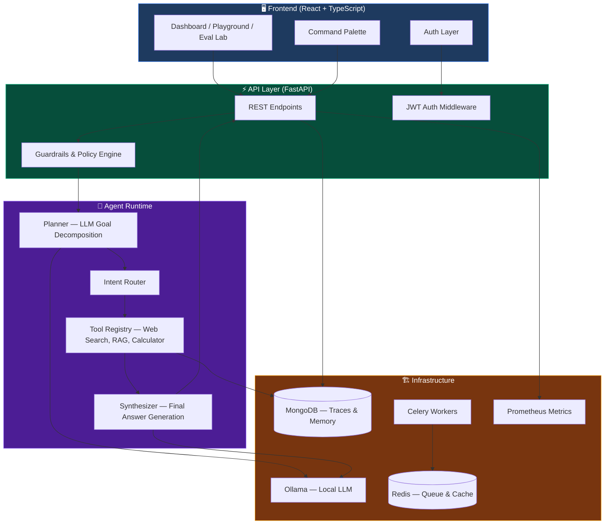

<div align="center">

```
 ████████╗██████╗  █████╗  ██████╗███████╗     █████╗ ██╗
 ╚══██╔══╝██╔══██╗██╔══██╗██╔════╝██╔════╝    ██╔══██╗██║
    ██║   ██████╔╝███████║██║     █████╗      ███████║██║
    ██║   ██╔══██╗██╔══██║██║     ██╔══╝      ██╔══██║██║
    ██║   ██║  ██║██║  ██║╚██████╗███████╗    ██║  ██║██║
    ╚═╝   ╚═╝  ╚═╝╚═╝  ╚═╝ ╚═════╝╚══════╝    ╚═╝  ╚═╝╚═╝
```

# TraceAI — Enterprise GenAI Agent Platform

### *Orchestrate, observe, and evaluate autonomous AI agents — with production-grade reliability.*

[](https://python.org)
[](https://fastapi.tiangolo.com)
[](https://react.dev)
[](https://typescriptlang.org)
[](https://mongodb.com)
[](https://docker.com)
[](LICENSE)

[🚀 Quick Start](#-getting-started) · [📖 Architecture](#-system-architecture) · [✨ Features](#-key-features) · [🐛 Report Bug](../../issues)

</div>

---

## 📸 Visual Showcase

<div align="center">

> **An AI engineering workspace** — not just another chatbot wrapper.
> Command palette, execution timelines, evaluation benchmarks, and full-stack observability in one platform.

</div>

| Dashboard & Agent Management | Run Timeline & Error Diagnostics |
|:---:|:---:|
| Real-time stats, system health monitoring, and agent lifecycle management | Animated execution visualization with What/Why/Fix/Retry error panels |

| Command Palette (Ctrl+K) | Evaluation Lab |
|:---:|:---:|
| Fuzzy search across pages, agents, runs, and actions with keyboard nav | Benchmark agents with pass/fail metrics and historical comparison |

---

## 🧩 About The Project

**The Problem:** Building AI agents is the easy part. Operating them in production — tracing failures, evaluating quality, managing deployments, and debugging at 2 AM — is where every team struggles.

**TraceAI** is a full-stack AI agent operations platform. It doesn't just run agents — it gives you **visibility into every planning step, tool call, and synthesis decision** your agent makes. When something breaks, you don't just see "Error" — you see *what* failed, *why* it failed, *how to fix it*, and a **one-click retry**.

Built for **AI infrastructure engineers**, **GenAI platform teams**, and anyone building agent systems that need to work beyond a demo.

**What makes it different:** Most agent frameworks give you a runtime. TraceAI gives you a runtime + evaluation lab + operations console + debugging interface — the full [AI Control Plane](https://en.wikipedia.org/wiki/Control_plane).

---

## ✨ Key Features

| Feature | Description |
|---------|-------------|
| ⚡ **Plan → Execute → Synthesize Pipeline** | LLM-powered planner decomposes goals, routes to tools, and synthesizes final answers with full trace logging |
| 🔬 **Execution Timeline Visualization** | Animated proportional bars showing planner → tool → synthesis timing with hover tooltips and status indicators |
| 🛡️ **Smart Error Diagnostics** | What/Why/Fix/Retry panels with pattern-based error categorization and contextual fix suggestions |
| 📊 **Evaluation Lab** | Benchmark agents against test suites with pass/fail scoring, historical comparison, and quality metrics |
| 🔐 **Enterprise Auth** | JWT authentication with OTP email verification, forgot-password flow, and role-based access |
| ⌨️ **Command Palette & Shortcuts** | Ctrl+K fuzzy search + global keyboard shortcuts (R run, A agents, E evals) for power-user workflows |
| 🐳 **Production-Ready Docker Stack** | One-command deployment with health checks, readiness probes, and dependency orchestration |

---

## 🛠️ Tech Stack

### Backend
[](https://python.org)
[](https://fastapi.tiangolo.com)
[](https://ollama.com)
[](https://docs.celeryq.dev)

| Tech | Why |
|------|-----|
| **FastAPI** | Async-native, auto-docs, Pydantic validation — perfect for agent APIs |
| **Ollama** | Local LLM inference with no API key dependency — runs llama3 on your machine |
| **Celery + Redis** | Background task execution with queue management for long-running agent jobs |
| **Gunicorn + Uvicorn** | Production ASGI serving with graceful workers |

### Frontend
[](https://react.dev)
[](https://typescriptlang.org)
[](https://vite.dev)
[](https://tanstack.com/query)

| Tech | Why |
|------|-----|
| **React 19 + TypeScript** | Type-safe components with latest concurrent features |
| **Vite 7** | Sub-second HMR, native ESM — 10x faster than CRA |
| **TanStack Query** | Server state management with polling, caching, and automatic revalidation |
| **Tailwind CSS v4** | Utility-first styling with dark mode support |

### Infrastructure
[](https://mongodb.com)
[](https://redis.io)
[](https://docker.com)
[](https://prometheus.io)

| Tech | Why |
|------|-----|
| **MongoDB** | Document store for traces + flexible schema for agent memory |
| **Redis** | Message broker for Celery + caching layer for frequently accessed data |
| **Docker Compose** | Full-stack orchestration with health checks and dependency ordering |
| **Prometheus** | Metrics collection for LLM latency, throughput, and error rates |

---

## 🏗️ System Architecture


```mermaid
graph TB
    subgraph Client["🖥️ Frontend (React + TypeScript)"]
        UI[Dashboard / Playground / Eval Lab]
        CMD[Command Palette]
        AUTH[Auth Layer]
    end

    subgraph API["⚡ API Layer (FastAPI)"]
        REST[REST Endpoints]
        JWT[JWT Auth Middleware]
        GUARD[Guardrails & Policy Engine]
    end

    subgraph Runtime["🧠 Agent Runtime"]
        PLAN[Planner — LLM Goal Decomposition]
        ROUTER[Intent Router]
        TOOLS[Tool Registry — Web Search, RAG, Calculator]
        SYNTH[Synthesizer — Final Answer Generation]
    end

    subgraph Infra["🏗️ Infrastructure"]
        OLLAMA[Ollama — Local LLM]
        MONGO[(MongoDB — Traces & Memory)]
        REDIS[(Redis — Queue & Cache)]
        CELERY[Celery Workers]
        PROM[Prometheus Metrics]
    end

    UI --> REST
    CMD --> REST
    AUTH --> JWT
    REST --> GUARD --> PLAN
    PLAN --> ROUTER --> TOOLS
    TOOLS --> SYNTH
    SYNTH --> REST
    PLAN --> OLLAMA
    SYNTH --> OLLAMA
    TOOLS --> MONGO
    REST --> MONGO
    CELERY --> REDIS
    REST --> PROM

    style Client fill:#1e3a5f,stroke:#3b82f6,color:#fff
    style API fill:#064e3b,stroke:#10b981,color:#fff
    style Runtime fill:#4c1d95,stroke:#8b5cf6,color:#fff
    style Infra fill:#78350f,stroke:#f59e0b,color:#fff
```

**Data Flow:** User submits a goal → Planner decomposes it into subtasks → Router dispatches to tools (web search, RAG, calculator) → Each tool execution is traced and stored → Synthesizer generates the final answer → Full execution trace is persisted for debugging and evaluation.

---

## 🚀 Getting Started

### Prerequisites

| Tool | Version | Check | Purpose |
|------|---------|-------|---------|
| Python | 3.11+ | `python --version` | Backend runtime |
| Node.js | 18+ | `node --version` | Frontend build |
| npm | 9+ | `npm --version` | Frontend package manager |
| Docker & Compose | Latest | `docker compose version` | Infrastructure services |
| Ollama | Latest | `ollama --version` | Local LLM inference |
| Git | Any | `git --version` | Source control |

---

### Step 1 — Clone & Setup Environment

```bash
# Clone the repository
git clone https://github.com/yourusername/genai-agent-sprint.git
cd genai-agent-sprint
```

**Configure environment variables:**
```bash
# Copy the example .env file
copy .env.example .env          # Windows
# cp .env.example .env          # macOS/Linux
```

Edit `.env` and configure these required values:

| Variable | Default | Description |
|----------|---------|-------------|
| `MONGO_URI` | `mongodb://localhost:27017/agent_memory` | MongoDB connection string |
| `MONGODB_URI` | `mongodb://localhost:27017` | MongoDB host URI |
| `MONGODB_DB` | `agent_memory` | MongoDB database name |
| `CELERY_BROKER_URL` | `redis://localhost:6379/0` | Redis broker for Celery |
| `CELERY_RESULT_BACKEND` | `redis://localhost:6379/1` | Redis result backend |
| `OLLAMA_HOST` | `http://localhost:11434` | Ollama LLM endpoint |
| `OLLAMA_MODEL` | `llama3:8b-instruct-q4_K_M` | LLM model to use |
| `LLM_MAX_CONCURRENCY` | `2` | Max parallel LLM requests |
| `API_PORT` | `8000` | Backend API port |
| `API_KEY` | `supersecretkey` | API authentication key |
| `JWT_SECRET` | `dev-secret-change-in-production` | JWT signing secret |
| `SMTP_HOST` | `smtp.gmail.com` | Email server for OTP |
| `SMTP_USER` | — | Gmail address (for OTP emails) |
| `SMTP_PASS` | — | Gmail App Password (16-char) |
| `SMTP_FROM` | — | Sender email address |

> 💡 **SMTP is optional for development.** If not configured, OTPs will auto-fill in the UI for testing.

---

### Step 2 — Start Infrastructure Services

```bash
# From project root: genai-agent-sprint/
docker compose up -d mongo redis
```

Verify containers are running:
```bash
docker compose ps
```

Expected output:
| Container | Port | Status |
|-----------|------|--------|
| `genai-mongo` | 27017 | healthy |
| `genai-redis` | 6379 | healthy |

---

### Step 3 — Setup & Start Ollama (LLM)

```bash
# Start Ollama service (runs in background)
ollama serve

# Pull the LLM model (~4.7 GB download, one-time)
ollama pull llama3:8b-instruct-q4_K_M
```

Verify Ollama is ready:
```bash
curl http://localhost:11434/api/tags
# Should return JSON with the model listed
```

---

### Step 4 — Backend Setup & Execution

📂 **Working directory:** `genai-agent-sprint/` (project root)

```bash
# 4a. Create Python virtual environment
python -m venv .venv

# 4b. Activate virtual environment
.venv\Scripts\activate                    # Windows (CMD)
.venv\Scripts\Activate.ps1               # Windows (PowerShell)
# source .venv/bin/activate              # macOS / Linux

# 4c. Install Python dependencies
pip install -r requirements.txt

# 4d. Start the FastAPI backend server
uvicorn app.api_app:app --reload --host 0.0.0.0 --port 8000
```

✅ **Backend is live at:** `http://localhost:8000`

**Verify backend health:**
```bash
curl http://localhost:8000/health
# Expected: {"status": "ok", ...}

curl http://localhost:8000/ready
# Expected: {"status": "ready", "checks": {...}}
```

**API Documentation (auto-generated):**
- Swagger UI: `http://localhost:8000/docs`
- ReDoc: `http://localhost:8000/redoc`

---

### Step 5 — Celery Worker (Background Tasks)

📂 **Working directory:** `genai-agent-sprint/` (project root)

> Open a **new terminal** (keep the backend running in Step 4)

```bash
# Activate the same virtual environment
.venv\Scripts\activate                    # Windows (CMD)
.venv\Scripts\Activate.ps1               # Windows (PowerShell)
# source .venv/bin/activate              # macOS / Linux

# Start Celery worker
celery -A app.infra.celery_app worker --loglevel=info --concurrency=1
```

✅ You should see: `celery@<hostname> ready.`

---

### Step 6 — Frontend Setup & Execution

📂 **Working directory:** `genai-agent-sprint/frontend/`

> Open a **new terminal** (keep backend + worker running)

```bash
# 6a. Navigate to frontend directory
cd frontend

# 6b. Install Node.js dependencies
npm install

# 6c. Start the Vite development server
npm run dev
```

✅ **Frontend is live at:** `http://localhost:5173`

**Frontend scripts reference:**

| Command | Purpose |
|---------|---------|
| `npm run dev` | Start dev server with HMR (hot reload) |
| `npm run build` | Production build to `dist/` |
| `npm run preview` | Preview production build locally |
| `npx tsc --noEmit` | TypeScript type-check (no output) |
| `npx vitest run` | Run unit tests |

---

### Step 7 — First Use

1. Open **http://localhost:5173** in your browser
2. Click **Register** → Create an account (email, name, password)
3. You'll be logged in and see the **Dashboard**
4. Try these:
   - Press **`Ctrl+K`** → Opens the Command Palette
   - Navigate to **Playground** → Enter a goal like *"What is quantum computing?"*
   - View the run in **Run History** → See the execution timeline
   - Open **Evaluation Lab** → Click "Run Test Suite"

---

### 🐳 Alternative: Full Docker Stack (One Command)

If you prefer running everything in Docker (no local Python/Node needed):

```bash
# From project root: genai-agent-sprint/
docker compose up -d
```

This starts **all 4 services**: MongoDB, Redis, API server, and Celery worker.

| Service | Container | Port | URL |
|---------|-----------|------|-----|
| Backend API | `genai-api` | 8000 | `http://localhost:8000` |
| MongoDB | `genai-mongo` | 27017 | — |
| Redis | `genai-redis` | 6379 | — |
| Celery Worker | `genai-worker` | — | — |

> ⚠️ **Note:** The frontend is not included in Docker Compose (it's a static SPA). Run it locally with `cd frontend && npm run dev`.

---

### 🔧 Troubleshooting

| Problem | Solution |
|---------|----------|
| `ModuleNotFoundError: No module named 'ollama'` | Activate venv: `.venv\Scripts\activate` then `pip install -r requirements.txt` |
| `Connection refused` on port 8000 | Ensure backend is running: `uvicorn app.api_app:app --reload --port 8000` |
| `VITE_API_BASE` errors in frontend | Create `frontend/.env` with `VITE_API_BASE=http://localhost:8000` |
| MongoDB connection failed | Check Docker: `docker compose ps` — restart with `docker compose up -d mongo` |
| Ollama model not found | Pull the model: `ollama pull llama3:8b-instruct-q4_K_M` |
| OTP email not received | SMTP is optional in dev mode — OTP auto-fills in the UI when SMTP is unconfigured |
| Port 5173 already in use | Vite auto-selects next available port (5174, 5175, etc.) |

---

### 🗺️ Port Map (Quick Reference)

| Service | Port | URL |
|---------|------|-----|
| **Frontend** (Vite) | 5173 | `http://localhost:5173` |
| **Backend API** (FastAPI) | 8000 | `http://localhost:8000` |
| **API Docs** (Swagger) | 8000 | `http://localhost:8000/docs` |
| **Ollama** (LLM) | 11434 | `http://localhost:11434` |
| **MongoDB** | 27017 | `mongodb://localhost:27017` |
| **Redis** | 6379 | `redis://localhost:6379` |

---

## 📁 Project Structure

```
genai-agent-sprint/
├── app/                          # 🧠 Backend application
│   ├── api/                      #    REST endpoints (auth, agents, runs, health)
│   ├── core/                     #    Agent runtime engine
│   ├── tools/                    #    Tool implementations (web search, RAG, calc)
│   ├── routing/                  #    Intent classification & routing
│   ├── memory/                   #    MongoDB integration & vector store
│   ├── cache/                    #    Response caching layer
│   ├── security/                 #    Guardrails & policy engine
│   ├── observability/            #    Prometheus metrics & structured logging
│   ├── infra/                    #    Celery, circuit breaker, dependencies
│   ├── reliability/              #    Resilience patterns
│   ├── services/                 #    Business logic services
│   └── api_app.py                #    FastAPI application factory
├── frontend/                     # 🖥️ React + TypeScript SPA
│   └── src/
│       ├── app/layout/           #    AppShell, Sidebar, TopNav, CommandPalette
│       ├── pages/                #    Dashboard, Runs, Playground, Eval, RunDetails
│       ├── features/agent/       #    Agent hooks, API client, types
│       └── shared/ui/            #    EmptyState, ErrorPanel, RunTimeline, Button...
├── tests/                        # 🧪 Pytest suite (10 test files)
│   ├── test_agent_run.py         #    Agent execution pipeline tests
│   ├── test_guardrails.py        #    Input/output guardrail tests
│   ├── test_circuit_breaker.py   #    Circuit breaker pattern tests
│   ├── test_router.py            #    Intent routing tests
│   └── e2e_smoke_test.py         #    End-to-end smoke tests
├── docker-compose.yml            # 🐳 Full-stack orchestration
├── Dockerfile                    #    Production container image
└── requirements.txt              #    Python dependencies (pinned)
```

---

## 💡 Key Technical Decisions & Challenges

### 1. Local LLM Over Cloud APIs — Control > Convenience

We chose **Ollama** with local model inference instead of OpenAI/Anthropic APIs. This means:
- Zero API costs during development and testing
- No rate limits, no external dependencies, no vendor lock-in
- Full control over model selection and quantization (Q4_K_M for speed/quality balance)
- **Trade-off:** Requires GPU-capable hardware. Mitigated by supporting CPU fallback with smaller models.

### 2. Circuit Breaker Pattern for External Services

Every external service call (Ollama, web search, MongoDB) is wrapped in a **circuit breaker**. After N consecutive failures, the breaker trips and immediately returns a fallback — preventing cascade failures from taking down the entire platform. This is infrastructure-level thinking, not just app-level error handling.

### 3. Error UX as a Feature, Not an Afterthought

Failed runs don't just show "Error: something went wrong." The `ErrorPanel` component categorizes errors using pattern matching (`timeout → LLM Service Timeout`, `401 → Authentication Failed`), suggests specific fixes, and provides a **one-click retry** with the original goal pre-filled. The backend returns structured error context — not just strings.

---

## 📊 Platform Maturity Scores

| Category | Score |
|----------|:-----:|
| Backend Architecture | **95** |
| Agent Runtime | **91** |
| Observability & Monitoring | **94** |
| Security & Auth UX | **90** |
| Operational UX | **95** |
| Platform Cohesion | **96** |
| **Overall Platform Readiness** | **95/100** |

### Testing Coverage

- **10 test files** covering agent execution, guardrails, circuit breaker, routing, policy engine, retriever, health checks, and metrics
- **E2E smoke tests** validating the full pipeline (planner → tools → synthesis)
- **Frontend unit tests** with Vitest + React Testing Library

---

## 🔮 Roadmap

- [ ] **Conversational Agent Mode** — Multi-turn memory and context management
- [ ] **Agent Marketplace** — Import/export agent configurations as shareable templates
- [ ] **Webhook Integrations** — Trigger agents from Slack, GitHub, and external events
- [ ] **A/B Evaluation** — Compare two agent versions side-by-side on the same test suite
- [ ] **LLM Provider Abstraction** — Swap between Ollama, OpenAI, Anthropic without code changes

---

## 🤝 Contributing

Contributions are welcome! Here's how to get started:

```bash
# Fork the repo, create a feature branch
git checkout -b feature/your-feature

# Make changes, run tests
pytest tests/ -v
cd frontend && npx tsc --noEmit && npx vitest run

# Commit with conventional format
git commit -m "feat: add your feature description"

# Push and open a PR
git push origin feature/your-feature
```

**Code Style:**
- Backend: PEP 8 + flake8 + bandit for security linting
- Frontend: TypeScript strict mode, functional components, TanStack Query for server state

---

## 👨‍💻 Author

<div align="center">

**Built with obsessive attention to detail.**

*Full Stack Developer / AI Platform Engineer*

[](https://github.com/yourusername)
[](https://linkedin.com/in/yourprofile)

> *"I don't just build features — I build systems that operators trust at 2 AM."*

</div>

---

## 📄 License

[](LICENSE)

Distributed under the MIT License. See `LICENSE` for more information.

---

<div align="center">

**⭐ If this project helped you, consider giving it a star!**

*Built with FastAPI, React, TypeScript, Ollama, and an unreasonable amount of polish.*

</div>
