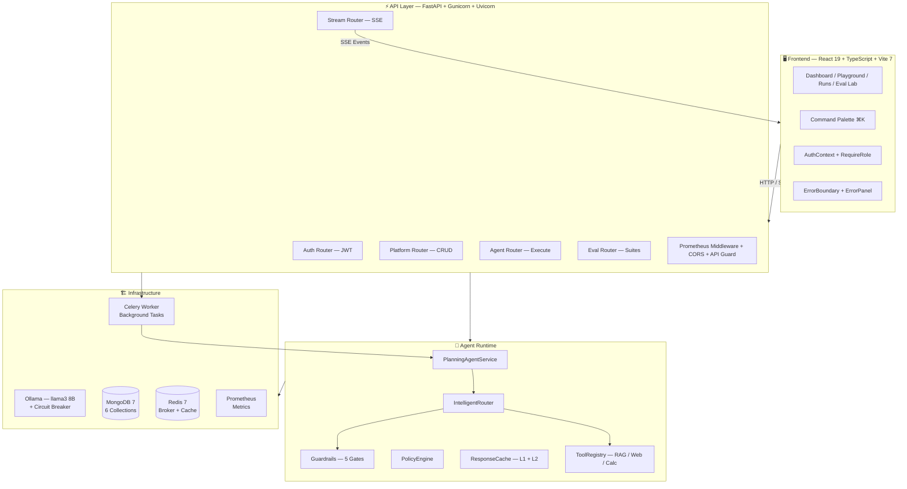
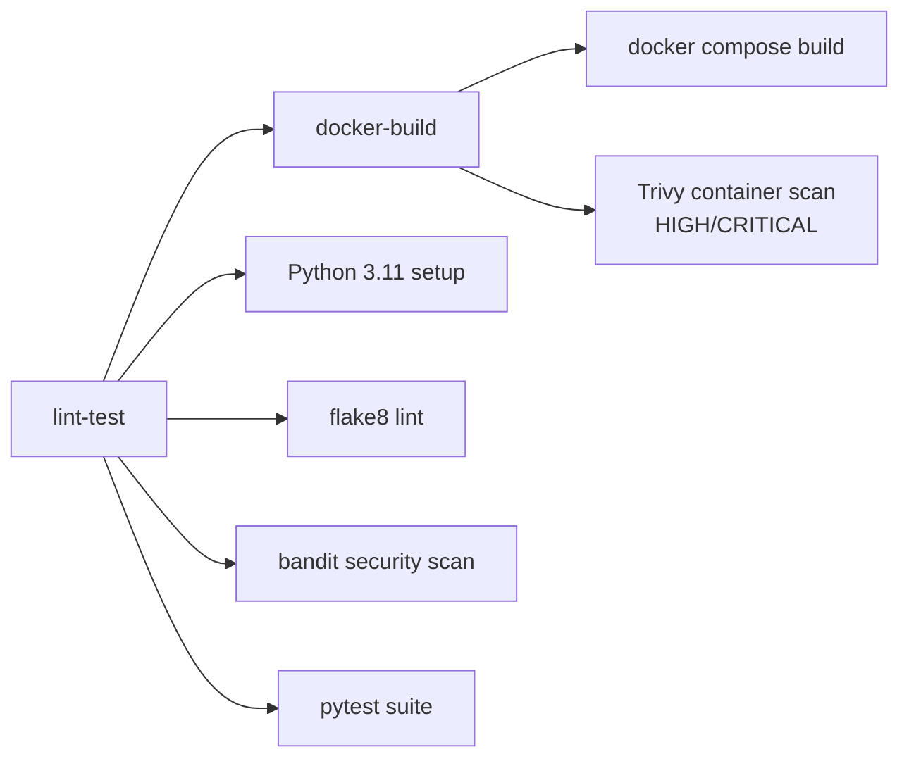
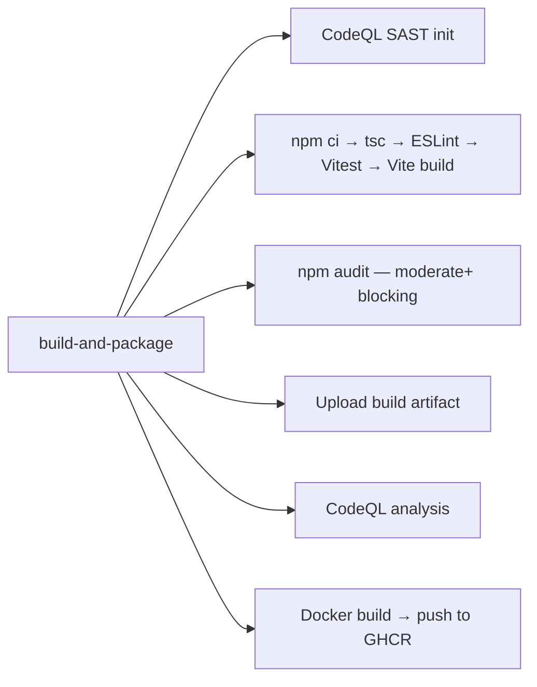
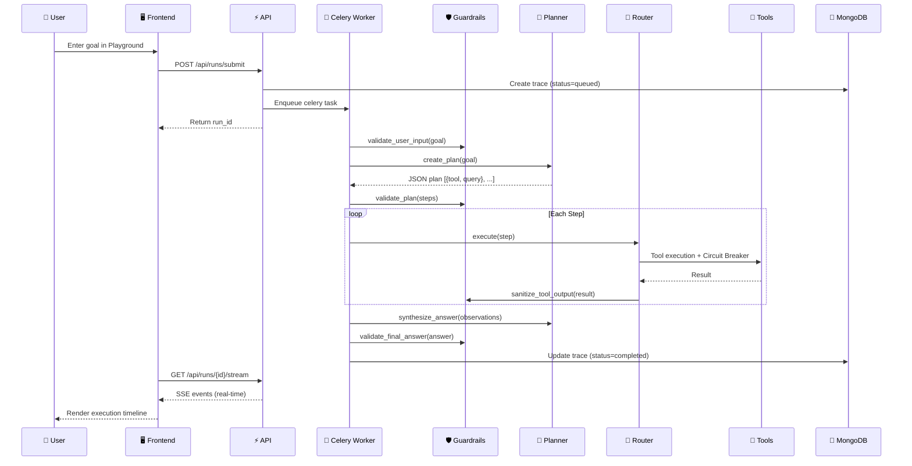

<div align="center">

<!-- ANIMATED HERO BANNER -->


<!-- TYPING SVG TAGLINE -->
<a href="https://github.com/Joylan9/genai-agent-sprint">
  
</a>

<br/>

<!-- BADGE ROW — STATUS -->
[](https://github.com/Joylan9/genai-agent-sprint/actions/workflows/ci.yml)
[](https://github.com/Joylan9/genai-agent-sprint/actions/workflows/frontend-cd.yml)
[](LICENSE)
[](https://github.com/Joylan9/genai-agent-sprint/commits/main)
[](https://github.com/Joylan9/genai-agent-sprint/pulls)

<!-- BADGE ROW — TECH STACK -->
[](https://python.org)
[](https://fastapi.tiangolo.com)
[](https://react.dev)
[](https://typescriptlang.org)
[](https://mongodb.com)
[](https://redis.io)
[](https://docker.com)
[](https://docs.celeryq.dev)
[](https://prometheus.io)

<br/>

**A full-stack AI agent operations platform that gives you complete visibility into every planning step, tool call, and synthesis decision your agents make — with the reliability your infrastructure demands.**

<br/>

[🚀 Quick Start](#-getting-started) · [🏗️ Architecture](#%EF%B8%8F-architecture) · [✨ Features](#-features) · [📡 API Reference](#-api-reference) · [🐛 Report Bug](https://github.com/Joylan9/genai-agent-sprint/issues)

</div>


## 📸 Visual Demo

<div align="center">


<br/>
<sub><i>🎬 AI Agent Orchestration — Plan, Execute, Observe, Evaluate</i></sub>

</div>

<details>
<summary><b>🖼️ More Screenshots</b></summary>

<br/>

<div align="center">

<table>
<tr>
<td width="50%" valign="top">


<br/><sub><b>📊 Dashboard</b> — Real-time stat cards, system health & recent runs</sub>

</td>
<td width="50%" valign="top">


<br/><sub><b>⚡ Playground</b> — Goal input with real-time SSE streaming results</sub>

</td>
</tr>
<tr>
<td width="50%" valign="top">


<br/><sub><b>🔬 Run Timeline</b> — Animated execution trace with timing breakdowns</sub>

</td>
<td width="50%" valign="top">


<br/><sub><b>🧪 Eval Lab</b> — Test suite results with pass/fail scoring</sub>

</td>
</tr>
<tr>
<td width="50%" valign="top">


<br/><sub><b>🛡️ Error Diagnostics</b> — What / Why / Fix / Retry panels</sub>

</td>
<td width="50%" valign="top">


<br/><sub><b>🔐 Login</b> — Premium auth interface with animated background</sub>

</td>
</tr>
</table>

</div>

</details>

<p align="right"><a href="#top">⬆ Back to top</a></p>


## 📋 Table of Contents

<details open>
<summary><b>Click to expand</b></summary>

- [📸 Visual Demo](#-visual-demo)
- [✨ Features](#-features)
- [🏗️ Architecture](#%EF%B8%8F-architecture)
- [🛠️ Tech Stack](#%EF%B8%8F-tech-stack)
- [🚀 Getting Started](#-getting-started)
- [📂 Project Structure](#-project-structure)
- [📡 API Reference](#-api-reference)
- [🔐 Authentication](#-authentication)
- [🧪 Testing](#-testing)
- [🚢 CI/CD](#-cicd)
- [📊 End-to-End Data Flow](#-end-to-end-data-flow)
- [🗺️ Roadmap](#%EF%B8%8F-roadmap)
- [🤝 Contributing](#-contributing)
- [📄 License](#-license)
- [👤 Author](#-author)

</details>


## ✨ Features

<table>
<tr>
<td width="50%" valign="top">

### ⚡ Agent Runtime
- 🧠 **Plan → Execute → Synthesize** pipeline — LLM decomposes goals into subtasks, routes to tools, and synthesizes answers
- 🔄 **Intelligent Routing** with failure-based and confidence-based fallback to web search
- 📦 **L1 + L2 Response Cache** — in-memory + MongoDB for sub-millisecond cache hits
- 💾 **3-Tier Memory** — short-term (session), long-term (MongoDB), coordinated via MemoryManager

### 🔬 Observability & Debugging
- 📊 **Execution Timeline** — animated proportional bars for planner → tool → synthesis timing
- 🛡️ **Smart Error Diagnostics** — What / Why / Fix / Retry panels with pattern-based categorization
- 📈 **Prometheus Metrics** — request count, latency, LLM call stats, failure counters
- ❤️ **Health & Readiness** probes with dependency checks

</td>
<td width="50%" valign="top">

### 🔐 Security & Guardrails
- 🚫 **5-Gate Security** — prompt injection, plan validation, output sanitization, memory poisoning, data leakage scanning
- 🏛️ **Policy Engine** — additional enforcement layer on top of guardrails
- 🔑 **JWT Auth** — hand-rolled HMAC-SHA256, zero external dependencies
- 👥 **RBAC** — admin / developer / viewer roles

### 🖥️ Production UX
- ⌨️ **Command Palette** (`Ctrl+K`) — fuzzy search across pages, agents, runs
- ⚙️ **8 Purpose-Built Pages** — Dashboard, Playground, Runs, RunDetails, Agents, Eval Lab, Login, System Status
- 📊 **Evaluation Lab** — 3-score weighted benchmarking (keyword 30%, tool accuracy 30%, LLM-as-judge 40%)
- 🐳 **One-Command Deploy** via Docker Compose with health checks & Celery workers

</td>
</tr>
</table>

<details>
<summary><b>🔄 Reliability Deep Dive — Circuit Breaker & Resilience</b></summary>

<br/>

Every external service call (Ollama, web search, MongoDB) is wrapped in an **async circuit breaker**:

```
CLOSED (normal)  ──[N consecutive failures]──►  OPEN (rejecting all calls)
                                                       │
                                              [recovery_timeout elapsed]
                                                       │
                                                       ▼
                                                 HALF_OPEN (testing)
                                                   │          │
                                              [success]   [failure]
                                                   │          │
                                                   ▼          ▼
                                                CLOSED       OPEN
```

| Parameter | LLM Circuit | Default |
|-----------|-------------|---------|
| `failure_threshold` | 4 | 5 |
| `recovery_timeout` | 30s | 30s |
| `execution_timeout` | 150s | 15s |

**Additional resilience:** Concurrency semaphore (max 2 parallel LLM calls), RetryPolicy with backoff, TimeoutExecutor, and ReliableExecutor wrapping all tools.

</details>

<details>
<summary><b>📦 Caching Deep Dive — L1 + L2 Response Cache</b></summary>

<br/>

| Layer | Storage | TTL | Speed |
|-------|---------|-----|-------|
| **L1** | In-memory dict (per process) | 1 hour | Instant |
| **L2** | MongoDB `response_cache` collection | TTL index auto-expiry | ~1ms |

**Lookup order:** L1 goal key → L1 plan key → L2 goal key → L2 plan key → cache miss → full agent execution.

Keys are SHA-256 hashes of normalized goal text and goal+plan combinations.

</details>

<details>
<summary><b>🔐 Security Deep Dive — 5-Gate Guardrails</b></summary>

<br/>

Every request passes through **five independent security gates** — all hard-blocks that raise `ValueError` immediately:

| Gate | Method | Patterns Detected |
|------|--------|------------------|
| **Input Validation** | `validate_user_input()` | 13 prompt injection patterns + 16KB input length limit |
| **Plan Validation** | `validate_plan()` | Max 12 steps, tool whitelist, step shape validation |
| **Output Sanitization** | `sanitize_tool_output()` | 8 malicious output patterns + sensitive data scanning |
| **Memory Protection** | `validate_memory_write()` | 7 memory poisoning indicators |
| **Answer Leakage** | `validate_final_answer()` | API keys, passwords, secrets, private keys, AWS credentials |

The **PolicyEngine** provides an additional enforcement layer on top of guardrails.

</details>

<details>
<summary><b>⏳ Background Tasks — Celery Architecture</b></summary>

<br/>

Long-running agent executions are decoupled from the API via **Celery**:

```
POST /api/runs/submit
    → Create trace (status=queued) in MongoDB
    → celery_app.send_task("agent.execute_run")
    → Return run_id immediately

Celery Worker picks up:
    → status=running → create_plan() → execute_plan() → synthesize_answer()
    → status=completed | failed
    → Emit run_events for SSE streaming
```

| Config | Value |
|--------|-------|
| `max_retries` | 1 |
| `time_limit` | 300s (hard kill) |
| `soft_time_limit` | 240s (graceful) |
| `acks_late` | `True` (at-least-once) |
| `reject_on_worker_lost` | `True` |

</details>

<p align="right"><a href="#top">⬆ Back to top</a></p>


## 🏗️ Architecture

<div align="center">
  
  <br/>
  <sub><i>System architecture powering intelligent agent orchestration</i></sub>
</div>

<br/>


```mermaid
graph TB
    subgraph Frontend["🖥️ Frontend — React 19 + TypeScript + Vite 7"]
        UI[Dashboard / Playground / Runs / Eval Lab]
        CMD[Command Palette ⌘K]
        AUTH_UI[AuthContext + RequireRole]
        ERR_UI[ErrorBoundary + ErrorPanel]
    end

    subgraph API["⚡ API Layer — FastAPI + Gunicorn + Uvicorn"]
        AUTH_API[Auth Router — JWT]
        PLATFORM[Platform Router — CRUD]
        AGENT_API[Agent Router — Execute]
        STREAM[Stream Router — SSE]
        EVAL_API[Eval Router — Suites]
        MW[Prometheus Middleware + CORS + API Guard]
    end

    subgraph Runtime["🧠 Agent Runtime"]
        PLANNER[PlanningAgentService]
        ROUTER[IntelligentRouter]
        GUARD[Guardrails — 5 Gates]
        POLICY[PolicyEngine]
        CACHE[ResponseCache — L1 + L2]
        TOOLS[ToolRegistry — RAG / Web / Calc]
    end

    subgraph Infra["🏗️ Infrastructure"]
        OLLAMA[Ollama — llama3 8B<br/>+ Circuit Breaker]
        MONGO[(MongoDB 7<br/>6 Collections)]
        REDIS[(Redis 7<br/>Broker + Cache)]
        CELERY[Celery Worker<br/>Background Tasks]
        PROM[Prometheus<br/>Metrics]
    end

    Frontend -->|HTTP / SSE| API
    API --> Runtime
    Runtime --> Infra
    PLANNER --> ROUTER
    ROUTER --> TOOLS
    ROUTER --> GUARD
    CELERY --> PLANNER
    API --> CELERY
    STREAM -->|SSE Events| Frontend
```

<details>
<summary><b>🧠 Agent Runtime — Deep Dive</b></summary>

<br/>

The core engine is `PlanningAgentService`, implementing a **Plan → Execute → Synthesize** pipeline:

| Stage | Method | What Happens |
|-------|--------|-------------|
| **Plan** | `create_plan()` | Sends goal to LLM. Requests JSON plan with `tool` + `query` per step. Retries JSON parsing up to `max_json_retries` times |
| **Parse** | `parse_plan_json()` | Robust JSON extraction — handles markdown fences, partial JSON, nested structures |
| **Execute** | `execute_plan()` | Iterates steps, routes each to `IntelligentRouter`, collects observations, applies guardrail validation, stores traces |
| **Synthesize** | `synthesize_answer()` | Combines observations + memory context → final coherent answer via LLM |

**IntelligentRouter** fallback strategies:
1. **Failure-based** — Primary tool errors → automatic fallback to `web_search`
2. **Confidence-based** — RAG similarity < 0.50 → transparent fallback to `web_search`

</details>

<details>
<summary><b>💾 Memory System — 3-Tier Architecture</b></summary>

<br/>

| Tier | Storage | Purpose |
|------|---------|---------|
| **Short-term** | In-process buffer | Session context within a single run |
| **Long-term** | MongoDB | Persistent cross-session memory |
| **Manager** | Orchestrator | Coordinates short + long term per session |

**MongoDB Collections & Indexes:**

| Collection | Indexes |
|------------|---------|
| `conversations` | `session_id`, `created_at` |
| `traces` | `request_id` (unique), `session_id`, `timestamp` |
| `agents` | `name_lower` (unique), `created_at` |
| `users` | `email` (unique), `created_at` |
| `run_events` | `run_id`, `timestamp` |
| `long_term_memory` | `session_id`, `created_at` |

</details>

<p align="right"><a href="#top">⬆ Back to top</a></p>


## 🛠️ Tech Stack

<div align="center">

### Backend

[](https://python.org)
[](https://fastapi.tiangolo.com)
[](https://ollama.com)
[](https://docs.celeryq.dev)
[](https://prometheus.io)
[](https://gunicorn.org)

### Frontend

[](https://react.dev)
[](https://typescriptlang.org)
[](https://vite.dev)
[](https://tailwindcss.com)
[](https://tanstack.com/query)
[](https://reactrouter.com)

### Database & Infrastructure

[](https://mongodb.com)
[](https://redis.io)
[](https://docker.com)
[](https://github.com/features/actions)
[](https://trivy.dev)
[](https://codeql.github.com)

</div>

<p align="right"><a href="#top">⬆ Back to top</a></p>


## 🚀 Getting Started

<div align="center">
  
  <br/>
  <sub><i>Get up and running in under 60 seconds</i></sub>
</div>

<br/>

> **Prerequisites:** Docker & Docker Compose · Ollama · Node.js 18+ · Python 3.11+

### Option A — Manual Setup

**1. Clone the repository**

```bash
git clone https://github.com/Joylan9/genai-agent-sprint.git
cd genai-agent-sprint
```

**2. Start infrastructure**

```bash
cd backend
docker compose up -d mongo redis
```

**3. Start the LLM engine**

```bash
ollama serve
ollama pull llama3:8b-instruct-q4_K_M
```

**4. Start the backend**

```bash
cd backend
python -m venv .venv
.venv\Scripts\Activate.ps1            # Windows PowerShell
# source .venv/bin/activate           # macOS / Linux
pip install -r requirements.txt
uvicorn app.api_app:app --reload --host 0.0.0.0 --port 8000
```

**5. Start the Celery worker** *(new terminal)*

```bash
cd backend
.venv\Scripts\Activate.ps1
celery -A app.infra.celery_app worker --loglevel=info --concurrency=1
```

**6. Start the frontend** *(new terminal)*

```bash
cd frontend
npm install
npm run dev
```

**7. Open** → **http://localhost:5173** → Register → Press `Ctrl+K` 🎉

---

### Option B — Full Docker Stack

```bash
cd backend
docker compose up -d        # Starts: MongoDB, Redis, API, Celery Worker
cd ../frontend && npm run dev  # Frontend SPA
```

<div align="center">

| Service | Container | Port | URL |
|---------|-----------|------|-----|
| **Backend API** | `genai-api` | 8000 | [http://localhost:8000](http://localhost:8000) |
| **API Docs** | — | 8000 | [http://localhost:8000/docs](http://localhost:8000/docs) |
| **Frontend** | — | 5173 | [http://localhost:5173](http://localhost:5173) |
| **MongoDB** | `genai-mongo` | 27017 | — |
| **Redis** | `genai-redis` | 6379 | — |
| **Ollama** | — | 11434 | [http://localhost:11434](http://localhost:11434) |

</div>

<p align="right"><a href="#top">⬆ Back to top</a></p>


## 📂 Project Structure

```
genai-agent-sprint/
├── 📁 backend/
│   ├── 📁 app/
│   │   ├── 📁 api/              # FastAPI routers (auth, platform, agent, stream, eval)
│   │   ├── 📁 cache/            # L1 + L2 response cache
│   │   ├── 📁 config/           # Runtime settings & environment config
│   │   ├── 📁 core/             # Vector store & core primitives
│   │   ├── 📁 infra/            # Celery, Ollama client, retry, timeout, validators
│   │   ├── 📁 memory/           # Short-term, long-term memory + manager
│   │   ├── 📁 observability/    # Health, readiness, Prometheus metrics
│   │   ├── 📁 registry/         # Tool registry (self-registering)
│   │   ├── 📁 reliability/      # Async circuit breaker
│   │   ├── 📁 routing/          # Intelligent router with fallback strategies
│   │   ├── 📁 security/         # Guardrails (5 gates) + policy engine
│   │   ├── 📁 services/         # Agent, planning, LLM, eval, retriever services
│   │   ├── 📁 tasks/            # Celery task definitions
│   │   ├── 📁 tools/            # RAG search, web search, calculator
│   │   └── api_app.py           # FastAPI application entry point
│   ├── 📁 data/                 # RAG documents & vector store
│   ├── 📁 eval/                 # Test cases for evaluation suites
│   ├── 📁 scripts/              # Utility scripts (backup, build, evaluate)
│   ├── 📁 tests/                # pytest suites (10 test files)
│   ├── docker-compose.yml
│   ├── Dockerfile
│   └── requirements.txt         # 44 pinned Python packages
├── 📁 frontend/
│   ├── 📁 src/
│   │   ├── 📁 app/              # Auth, errors, monitoring, providers, telemetry
│   │   ├── 📁 features/         # Feature modules (agent API, hooks, types)
│   │   ├── 📁 pages/            # 8 page components
│   │   ├── 📁 shared/           # 14+ reusable UI components
│   │   ├── 📁 mocks/            # MSW mock handlers
│   │   ├── App.tsx
│   │   └── main.tsx
│   ├── 📁 e2e/                  # Playwright end-to-end tests
│   ├── package.json
│   └── vite.config.ts
├── 📁 frontend-handoff/         # OpenAPI spec, Postman collection, acceptance tests
├── 📁 assets/                   # Project documentation & guides
├── 📁 .github/workflows/        # CI/CD pipelines (ci.yml, frontend-cd.yml)
└── README.md
```

<p align="right"><a href="#top">⬆ Back to top</a></p>


## 📡 API Reference

<div align="center">

### 🔐 Authentication

| Method | Endpoint | Description | Auth |
|--------|----------|-------------|------|
| `POST` | `/api/auth/register` | Register a new user | ❌ |
| `POST` | `/api/auth/login` | Login, receive JWT tokens | ❌ |
| `POST` | `/api/auth/refresh` | Refresh access token | ❌ |
| `GET` | `/api/auth/me` | Get current user profile | ✅ |

### 🤖 Agents

| Method | Endpoint | Description | Auth |
|--------|----------|-------------|------|
| `GET` | `/api/agents` | List all agents | ✅ |
| `POST` | `/api/agents` | Create a new agent | ✅ |
| `GET` | `/api/agents/{id}/versions` | List agent versions | ✅ |
| `POST` | `/api/agents/{id}/versions` | Create new version | ✅ |
| `POST` | `/api/agents/{id}/versions/{v}/promote` | Promote version | ✅ |

### ▶️ Runs

| Method | Endpoint | Description | Auth |
|--------|----------|-------------|------|
| `POST` | `/api/runs/submit` | Submit async agent run | ✅ |
| `GET` | `/api/runs` | List runs (search/filter) | ✅ |
| `GET` | `/api/runs/{id}/status` | Get run status | ✅ |
| `GET` | `/api/runs/{id}/stream` | SSE stream for run events | ✅ |
| `GET` | `/traces/{id}` | Get execution trace | ✅ |

### 🧪 Evaluation

| Method | Endpoint | Description | Auth |
|--------|----------|-------------|------|
| `GET` | `/api/eval/suites` | List evaluation suites | ✅ |
| `POST` | `/api/eval/run-suite` | Run evaluation suite | ✅ |

### 💚 Health

| Method | Endpoint | Description | Auth |
|--------|----------|-------------|------|
| `GET` | `/health` | Basic health status | ❌ |
| `GET` | `/ready` | Dependency health checks | ❌ |

</div>

<p align="right"><a href="#top">⬆ Back to top</a></p>


## 🔐 Authentication

- Protected routes expect `Authorization: Bearer <access_token>`
- Auth responses include `user.role` with `admin | developer | viewer`
- Development bypass available when `AUTH_DEV_BYPASS_ENABLED=true`
- OTP echo available when `DEV_EMAIL_OTP_ECHO_ENABLED=true`
- Hand-rolled JWT using stdlib `hmac` / `hashlib` — HMAC-SHA256, zero external dependencies
- Full forgot-password flow: request OTP → verify → reset token → new password

<p align="right"><a href="#top">⬆ Back to top</a></p>


## 🧪 Testing

### Backend — pytest

```bash
cd backend
python -m pytest tests/ -v
```

| Test File | Coverage Area |
|-----------|--------------|
| `test_agent_run.py` | Full agent execution pipeline — plan creation, execution, synthesis |
| `test_guardrails.py` | All 5 guardrail methods — injection, plan, output, memory, leakage |
| `test_router.py` | Intelligent router — tool resolution, failure & confidence fallback |
| `test_circuit_breaker.py` | State transitions: CLOSED → OPEN → HALF_OPEN → CLOSED |
| `test_policy_engine.py` | Policy engine enforcement rules |
| `test_retriever.py` | RAG retriever service |
| `test_health.py` | Health and readiness endpoint responses |
| `test_metrics.py` | Prometheus metrics emission |
| `e2e_smoke_test.py` | End-to-end pipeline: API → planner → tools → synthesis |
| `conftest.py` | Shared fixtures — mocked Ollama, MongoDB, agent instances |

### Frontend — Vitest + React Testing Library

```bash
cd frontend
npm run test
```

- Component unit tests with **Vitest** + **React Testing Library**
- Accessibility tests via `axe-core` (`a11y.test.tsx`)
- End-to-end tests via **Playwright** (`e2e/`)

<p align="right"><a href="#top">⬆ Back to top</a></p>


## 🚢 CI/CD

### Backend CI (`ci.yml`)


```mermaid
graph LR
    A[lint-test] --> B[docker-build]
    A --> A1[Python 3.11 setup]
    A --> A2[flake8 lint]
    A --> A3[bandit security scan]
    A --> A4[pytest suite]
    B --> B1[docker compose build]
    B --> B2[Trivy container scan<br/>HIGH/CRITICAL]
```

### Frontend CD (`frontend-cd.yml`)


```mermaid
graph LR
    C[build-and-package] --> C1[CodeQL SAST init]
    C --> C2[npm ci → tsc → ESLint → Vitest → Vite build]
    C --> C3[npm audit — moderate+ blocking]
    C --> C4[Upload build artifact]
    C --> C5[CodeQL analysis]
    C --> C6[Docker build → push to GHCR]
```

<p align="right"><a href="#top">⬆ Back to top</a></p>


## 📊 End-to-End Data Flow

<div align="center">
  
  <br/>
  <sub><i>Tracing every step from user goal to synthesized answer</i></sub>
</div>

<br/>


```mermaid
sequenceDiagram
    participant U as 👤 User
    participant F as 🖥️ Frontend
    participant A as ⚡ API
    participant C as 🔧 Celery Worker
    participant G as 🛡️ Guardrails
    participant P as 🧠 Planner
    participant R as 🔄 Router
    participant T as 🔨 Tools
    participant M as 💾 MongoDB

    U->>F: Enter goal in Playground
    F->>A: POST /api/runs/submit
    A->>M: Create trace (status=queued)
    A->>C: Enqueue celery task
    A-->>F: Return run_id
    C->>G: validate_user_input(goal)
    C->>P: create_plan(goal)
    P-->>C: JSON plan [{tool, query}, ...]
    C->>G: validate_plan(steps)
    loop Each Step
        C->>R: execute(step)
        R->>T: Tool execution + Circuit Breaker
        T-->>R: Result
        R->>G: sanitize_tool_output(result)
    end
    C->>P: synthesize_answer(observations)
    C->>G: validate_final_answer(answer)
    C->>M: Update trace (status=completed)
    F->>A: GET /api/runs/{id}/stream
    A-->>F: SSE events (real-time)
    F-->>U: Render execution timeline
```

<p align="right"><a href="#top">⬆ Back to top</a></p>


## 🗺️ Roadmap

- [x] Plan → Execute → Synthesize agent pipeline
- [x] 5-gate security guardrails (hard-blocks)
- [x] JWT authentication with RBAC (admin/developer/viewer)
- [x] Circuit breaker on all external calls
- [x] L1 + L2 response caching
- [x] Celery background task execution
- [x] SSE real-time streaming
- [x] Prometheus observability metrics
- [x] Execution timeline visualization
- [x] Smart error diagnostics (What/Why/Fix/Retry)
- [x] Command palette (Ctrl+K)
- [x] Evaluation lab with 3-score benchmarking
- [x] CI/CD with Trivy + CodeQL + GHCR
- [ ] Multi-model support (GPT-4, Claude, Gemini)
- [ ] Agent marketplace & sharing
- [ ] WebSocket upgrade for real-time traces
- [ ] Kubernetes Helm chart deployment
- [ ] OpenTelemetry distributed tracing integration
- [ ] Plugin system for custom tools

<p align="right"><a href="#top">⬆ Back to top</a></p>


## 🤝 Contributing

Contributions are welcome! Here's how to get started:

```bash
# 1. Fork the repo, create a feature branch
git checkout -b feature/your-feature

# 2. Backend: lint, scan, test
cd backend
flake8 app --max-line-length=120
bandit -r app -lll
pytest tests/ -v

# 3. Frontend: type-check, lint, test
cd ../frontend
npx tsc --noEmit
npx vitest run

# 4. Commit with conventional format
git commit -m "feat: add your feature description"
git push origin feature/your-feature
```

**Standards enforced:**
- **Backend** — PEP 8 + flake8 + bandit security scanning
- **Frontend** — TypeScript strict mode + ESLint + Prettier

<p align="right"><a href="#top">⬆ Back to top</a></p>


## 📄 License

<div align="center">

[](LICENSE)

Distributed under the **MIT License**. See `LICENSE` for details.

</div>


## 👤 Author

<div align="center">

**Joylan Dsouza**

[](https://github.com/Joylan9)
[](mailto:joylan928@gmail.com)

<br/>

> *"I don't just build features — I build systems that operators trust at 2 AM."*

<br/>

⭐ **Star this repository if TraceAI resonated with you.**

*Built with FastAPI, React 19, TypeScript, Ollama, and an unreasonable amount of engineering discipline.*

</div>

<!-- FOOTER WAVE -->

