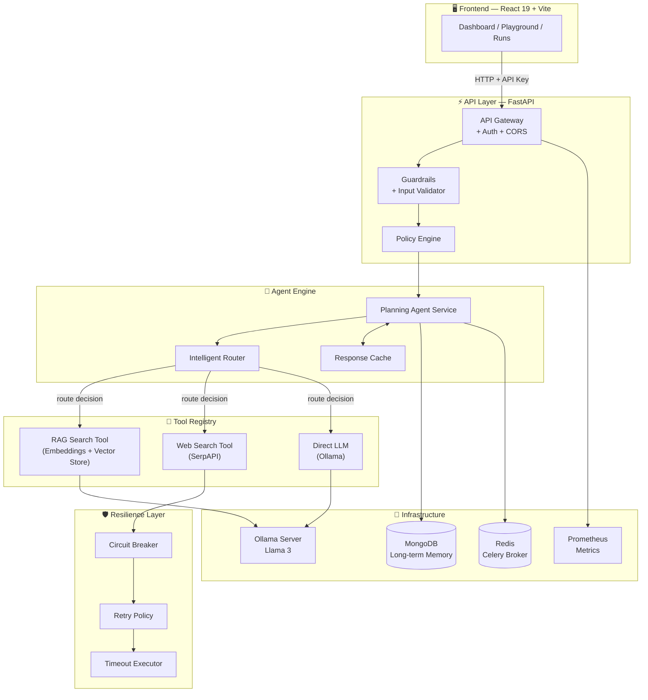

<div align="center">

```
  ██████╗ ███████╗███╗   ██╗ █████╗ ██╗      █████╗  ██████╗ ███████╗███╗   ██╗████████╗
 ██╔════╝ ██╔════╝████╗  ██║██╔══██╗██║     ██╔══██╗██╔════╝ ██╔════╝████╗  ██║╚══██╔══╝
 ██║  ███╗█████╗  ██╔██╗ ██║███████║██║     ███████║██║  ███╗█████╗  ██╔██╗ ██║   ██║
 ██║   ██║██╔══╝  ██║╚██╗██║██╔══██║██║     ██╔══██║██║   ██║██╔══╝  ██║╚██╗██║   ██║
 ╚██████╔╝███████╗██║ ╚████║██║  ██║███████╗██║  ██║╚██████╔╝███████╗██║ ╚████║   ██║
  ╚═════╝ ╚══════╝╚═╝  ╚═══╝╚═╝  ╚═╝╚══════╝╚═╝  ╚═╝ ╚═════╝ ╚══════╝╚═╝  ╚═══╝   ╚═╝
```

# GenAI Agent Platform

### _An enterprise-grade autonomous AI agent engine that thinks, plans, and executes — so you don't have to._

[](https://python.org)
[](https://fastapi.tiangolo.com)
[](https://react.dev)
[](https://typescriptlang.org)
[](https://mongodb.com)
[](https://docker.com)
[](LICENSE)
[](https://github.com/Joylan9/genai-agent-sprint)

[🚀 Live Demo](http://localhost:5173) &nbsp;&nbsp;•&nbsp;&nbsp; [📖 Docs](frontend-handoff/API_README.md) &nbsp;&nbsp;•&nbsp;&nbsp; [🐛 Report Bug](https://github.com/Joylan9/genai-agent-sprint/issues)

</div>

---

## 📸 Visual Showcase

<div align="center">

> **🖥️ A fully interactive AI playground where you can query an autonomous agent, inspect its multi-step reasoning plans, explore RAG-powered knowledge retrieval, and monitor real-time system health — all from a single dashboard.**

| Dashboard & Health Monitor | AI Playground & Reasoning |
|:-:|:-:|
| _Real-time metrics, system health, and agent run history_ | _Interactive prompt, step-by-step plan execution, and tool usage_ |

</div>

---

## 🧩 About The Project

Most "AI chatbots" are glorified text-completion wrappers. They don't **think**, they don't **plan**, and they definitely don't **self-correct**. The moment a task requires more than one step, they crumble.

**GenAI Agent Platform** solves this by implementing a **Plan → Execute → Synthesize** agentic loop powered by local LLMs (Ollama). The agent decomposes complex user goals into multi-step plans, intelligently routes each step to the right tool (RAG knowledge search, live web search, or direct LLM reasoning), executes with circuit-breaker resilience, and synthesizes a final coherent answer — all while maintaining conversational memory.

Built for **AI engineers, researchers, and enterprise teams** who want an open-source, fully self-hosted alternative to closed-source agent frameworks — with production-grade observability, security guardrails, and policy enforcement baked in from day one.

---

## ✨ Key Features

- 🧠 **Autonomous Plan-Execute-Synthesize Agent** — Decomposes complex goals into multi-step plans, executes each with the right tool, and synthesizes a coherent answer
- 🔍 **Hybrid RAG Pipeline** — Sentence-transformers embeddings + vector store retrieval for knowledge-grounded responses
- 🌐 **Live Web Search** — SerpAPI-powered real-time web search tool for up-to-date information
- 💾 **Dual Memory System** — Short-term conversational memory + MongoDB-backed long-term recall across sessions
- 🛡️ **Enterprise Security Layer** — Input guardrails, output content filtering, and policy engine enforcement at every pipeline stage
- ⚡ **Resilient Infrastructure** — Circuit breakers on external services, retry policies, timeout executors, and LLM concurrency guards
- 📊 **Full Observability Stack** — Prometheus metrics, structured JSON logging, health/readiness probes, and per-request latency tracking

---

## 🛠️ Tech Stack

<div align="center">

### Backend

[](https://python.org)
[](https://fastapi.tiangolo.com)
[](https://gunicorn.org)
[](https://ollama.com)
[](https://docs.celeryq.dev)
[](https://prometheus.io)

### Frontend

[](https://react.dev)
[](https://typescriptlang.org)
[](https://vite.dev)
[](https://tailwindcss.com)

### Database & Infra

[](https://mongodb.com)
[](https://redis.io)
[](https://docker.com)
[](https://nginx.org)
[](https://github.com/features/actions)

</div>

| Category | Technology | Why This Choice |
|----------|-----------|-----------------|
| **LLM Runtime** | Ollama + Llama 3 | Fully local, zero API cost, privacy-first inference |
| **API Framework** | FastAPI + Gunicorn | Async-native, auto OpenAPI docs, production WSGI server |
| **Embeddings** | sentence-transformers | Proven, fast, runs on CPU — no GPU dependency |
| **Memory** | MongoDB | Flexible document model for agent traces + session memory |
| **Task Queue** | Celery + Redis | Battle-tested async task processing with result backend |
| **Frontend** | React 19 + Vite | Latest concurrent features, instant HMR during dev |
| **Observability** | Prometheus + structured logs | Industry-standard metrics pipeline, JSON-parsable logs |
| **Security** | Guardrails + Policy Engine | Multi-layer content filtering before and after LLM calls |

---

## 🏗️ System Architecture


```mermaid
flowchart TB
    subgraph CLIENT["🖥️ Frontend — React 19 + Vite"]
        UI["Dashboard / Playground / Runs"]
    end

    subgraph API_LAYER["⚡ API Layer — FastAPI"]
        GW["API Gateway\n+ Auth + CORS"]
        GUARD["Guardrails\n+ Input Validator"]
        POLICY["Policy Engine"]
    end

    subgraph AGENT_ENGINE["🧠 Agent Engine"]
        ROUTER["Intelligent Router"]
        PLANNER["Planning Agent Service"]
        CACHE["Response Cache"]
    end

    subgraph TOOLS["🔧 Tool Registry"]
        RAG["RAG Search Tool\n(Embeddings + Vector Store)"]
        WEB["Web Search Tool\n(SerpAPI)"]
        LLM_TOOL["Direct LLM\n(Ollama)"]
    end

    subgraph INFRA["🏢 Infrastructure"]
        MONGO[("MongoDB\nLong-term Memory")]
        REDIS[("Redis\nCelery Broker")]
        OLLAMA["Ollama Server\nLlama 3"]
        PROM["Prometheus\nMetrics"]
    end

    subgraph RESILIENCE["🛡️ Resilience Layer"]
        CB["Circuit Breaker"]
        RETRY["Retry Policy"]
        TIMEOUT["Timeout Executor"]
    end

    UI -->|HTTP + API Key| GW
    GW --> GUARD --> POLICY --> PLANNER
    PLANNER --> ROUTER
    ROUTER -->|route decision| RAG
    ROUTER -->|route decision| WEB
    ROUTER -->|route decision| LLM_TOOL
    PLANNER <--> CACHE
    RAG --> OLLAMA
    WEB --> CB
    LLM_TOOL --> OLLAMA
    CB --> RETRY --> TIMEOUT
    PLANNER --> MONGO
    PLANNER --> REDIS
    GW --> PROM
```

**Data Flow:** User sends a goal → API validates & applies guardrails → Planning Agent creates a multi-step plan → Intelligent Router assigns each step to the optimal tool → Tools execute with circuit-breaker protection → Results are synthesized into a final answer → Everything is persisted to MongoDB for memory recall.

---

## 🚀 Getting Started

### Prerequisites

| Tool | Version | Purpose |
|------|---------|---------|
| [Docker Desktop](https://www.docker.com/products/docker-desktop/) | 24+ | Container runtime |
| [Ollama](https://ollama.com) | Latest | Local LLM inference |
| [Node.js](https://nodejs.org) | 18+ | Frontend dev server |
| [Python](https://python.org) | 3.11+ | Backend (local dev only) |
| [Git](https://git-scm.com) | Latest | Version control |

### Quick Start (Docker — Recommended)

```bash
# 1. Clone the repository
git clone https://github.com/Joylan9/genai-agent-sprint.git
cd genai-agent-sprint

# 2. Pull the LLM model (one-time, ~4.7 GB)
ollama pull llama3:8b-instruct-q4_K_M

# 3. Configure environment
cp .env.example .env
# Edit .env — fill in your API_KEY, HF_TOKEN, and SERPAPI_KEY

# 4. Launch the full backend stack
docker compose up -d

# 5. Start the frontend
cd frontend
npm install
npm run dev
```

🎉 **Open http://localhost:5173** — Backend API is live at http://localhost:8000

### Environment Variables

| Variable | Description | Default |
|----------|------------|---------|
| `MONGO_URI` | MongoDB connection string | `mongodb://mongo:27017/agent_memory` |
| `CELERY_BROKER_URL` | Redis broker for Celery | `redis://redis:6379/0` |
| `OLLAMA_HOST` | Ollama server URL | `http://host.docker.internal:11434` |
| `OLLAMA_MODEL` | LLM model to use | `llama3:8b-instruct-q4_K_M` |
| `API_KEY` | API authentication key | `__CHANGE_ME__` |
| `HF_TOKEN` | HuggingFace token for embeddings | `__HF_TOKEN__` |
| `SERPAPI_KEY` | SerpAPI key for web search | `__SERPAPI_KEY__` |
| `LLM_MAX_CONCURRENCY` | Max concurrent LLM requests | `2` |
| `SIMILARITY_THRESHOLD` | RAG retrieval similarity cutoff | `0.50` |
| `TIMEOUT_SECONDS` | Request timeout | `10` |

---

## 🔧 Detailed Execution Guide

### 📦 Backend — Docker Compose (Recommended)

This spins up **MongoDB**, **Redis**, **FastAPI API**, and **Celery Worker** in containers.

**Works on: Windows (PowerShell), macOS, Ubuntu/Linux**

```powershell
# From the project root: d:\GenAI and AgenticAI\genai-agent-sprint

# Step 1 — Make sure Ollama is running on your host machine
ollama serve                          # Start Ollama (if not already running)
ollama pull llama3:8b-instruct-q4_K_M # Pull the model (one-time)

# Step 2 — Configure environment
cp .env.example .env                  # Copy template
# Edit .env and set: API_KEY, HF_TOKEN, SERPAPI_KEY

# Step 3 — Launch all services
docker compose up -d

# Step 4 — Verify everything is healthy
docker compose ps                     # All services should show "healthy"

# Step 5 — Check API is responding
Invoke-RestMethod -Uri http://localhost:8000/       # PowerShell
# OR
curl http://localhost:8000/                          # Ubuntu / macOS

# Useful commands
docker compose logs -f api            # Follow API logs
docker compose logs -f                # Follow ALL logs
docker compose down                   # Stop everything
docker compose up -d --build          # Rebuild and restart
```

**What's running after `docker compose up -d`:**

| Container | Service | Port | Purpose |
|-----------|---------|------|---------|
| `genai-api` | FastAPI + Gunicorn | `8000` | REST API server |
| `genai-mongo` | MongoDB 7 | `27017` | Long-term memory + agent traces |
| `genai-redis` | Redis 7 Alpine | `6379` | Celery broker + result backend |
| `genai-worker` | Celery Worker | — | Async task processing |

---

### 🐍 Backend — Local Development (Without Docker)

Use this when you need **hot-reload** and **debugger** access.

**Works on: Windows (PowerShell / WSL), Ubuntu/Linux**

#### On Windows (PowerShell)

```powershell
# Navigate to project root
cd "d:\GenAI and AgenticAI\genai-agent-sprint"

# Create and activate virtual environment (one-time)
python -m venv .venv
.\.venv\Scripts\Activate

# Install dependencies
pip install -r requirements.txt

# Update .env for local development — change these lines:
#   MONGO_URI=mongodb://localhost:27017/agent_memory
#   MONGODB_URI=mongodb://localhost:27017
#   CELERY_BROKER_URL=redis://localhost:6379/0
#   CELERY_RESULT_BACKEND=redis://localhost:6379/1
#   OLLAMA_HOST=http://localhost:11434

# Make sure MongoDB and Redis are running locally (or via Docker):
docker run -d --name mongo -p 27017:27017 mongo:7
docker run -d --name redis -p 6379:6379 redis:7-alpine

# Start the FastAPI server with hot-reload
uvicorn app.api_app:app --host 0.0.0.0 --port 8000 --reload
```

#### On Ubuntu / WSL

```bash
# Navigate to project root
cd /path/to/genai-agent-sprint

# Create and activate virtual environment (one-time)
python3 -m venv .venv
source .venv/bin/activate

# Install dependencies
pip install -r requirements.txt

# Start MongoDB and Redis
sudo systemctl start mongod       # If installed natively
# OR use Docker:
docker run -d --name mongo -p 27017:27017 mongo:7
docker run -d --name redis -p 6379:6379 redis:7-alpine

# Start Ollama
ollama serve &
ollama pull llama3:8b-instruct-q4_K_M

# Update .env — set URIs to localhost (see Windows section above)

# Run the API server
uvicorn app.api_app:app --host 0.0.0.0 --port 8000 --reload

# (Optional) Run Celery worker in a separate terminal
celery -A app.infra.celery_app worker --loglevel=info --concurrency=1
```

---

### 🎨 Frontend — Vite Dev Server

**Works on: Windows (PowerShell), macOS, Ubuntu/Linux**

```powershell
# Navigate to frontend directory
cd "d:\GenAI and AgenticAI\genai-agent-sprint\frontend"
# Ubuntu: cd /path/to/genai-agent-sprint/frontend

# Install dependencies (one-time)
npm install

# Start the dev server with hot module reloading
npm run dev
# → Opens at http://localhost:5173

# Other frontend commands
npm run build      # Production build → frontend/dist/
npm run preview    # Preview production build locally
npm run lint       # Run ESLint checks
npm run test       # Run Vitest unit tests
```

**Frontend `.env` file** (`frontend/.env`):
```env
VITE_API_BASE=http://localhost:8000
VITE_API_KEY=supersecretkey
```

> ⚠️ **Important:** The `VITE_API_KEY` must match the `API_KEY` in the backend `.env` file.

---

### 🧪 Running Tests

```powershell
# Backend tests (from project root)
cd "d:\GenAI and AgenticAI\genai-agent-sprint"
.\.venv\Scripts\Activate
pytest tests/ -v

# Frontend unit tests
cd frontend
npm run test

# Frontend E2E tests (Playwright)
npx playwright install     # One-time browser install
npx playwright test
```

---

## 📁 Project Structure

```
genai-agent-sprint/
│
├── app/                              # 🧠 Backend application core
│   ├── api_app.py                    # FastAPI entry point (Gunicorn loads this)
│   ├── main.py                       # CLI entry point for direct interaction
│   ├── agent.py                      # Agent interface stub
│   ├── planning_agent_main.py        # Standalone planning agent runner
│   │
│   ├── api/                          # REST API route handlers
│   │   ├── app.py                    # Main API routes + middleware
│   │   ├── dependencies.py           # Dependency injection (auth, services)
│   │   └── schemas.py                # Pydantic request/response models
│   │
│   ├── services/                     # Business logic layer
│   │   ├── planning_agent_service.py # ⭐ Core: Plan → Execute → Synthesize loop
│   │   ├── agent_service.py          # Simple single-turn agent service
│   │   ├── llm_service.py            # LLM interaction wrapper
│   │   ├── embedding_service.py      # Sentence-transformers embedding service
│   │   ├── retriever_service.py      # Vector similarity retrieval
│   │   └── memory_service.py         # Conversational memory management
│   │
│   ├── tools/                        # Agent tool registry
│   │   ├── tools.py                  # Tool registration + discovery
│   │   ├── rag_search_tool.py        # RAG-powered knowledge retrieval
│   │   └── web_search_tool.py        # SerpAPI live web search
│   │
│   ├── memory/                       # Memory subsystem
│   │   ├── database.py               # MongoDB connection + operations
│   │   ├── memory_manager.py         # Unified memory orchestrator
│   │   ├── short_term_memory.py      # In-session conversational memory
│   │   ├── long_term_memory.py       # Cross-session persistent memory
│   │   └── models.py                 # Memory data models
│   │
│   ├── security/                     # Security & governance
│   │   ├── guardrails.py             # Input/output content filtering
│   │   ├── policy_engine.py          # Plan & output policy enforcement
│   │   └── input_validator.py        # Request validation + sanitization
│   │
│   ├── routing/                      # Intelligent task routing
│   │   └── intelligent_router.py     # Routes steps to optimal tools
│   │
│   ├── reliability/                  # Resilience patterns
│   │   └── circuit_breaker.py        # Circuit breaker for external services
│   │
│   ├── infra/                        # Infrastructure layer
│   │   ├── ollama_client.py          # Ollama LLM client with concurrency guard
│   │   ├── celery_app.py             # Celery application config
│   │   ├── logger.py                 # Structured logging + Prometheus counters
│   │   ├── retry_policy.py           # Configurable retry strategies
│   │   ├── timeout_executor.py       # Async timeout wrapper
│   │   ├── reliable_executor.py      # Combined retry + timeout executor
│   │   └── validators.py             # Infrastructure-level validators
│   │
│   ├── observability/                # Monitoring & health
│   │   ├── health.py                 # /health endpoint (system status)
│   │   ├── readiness.py              # /ready endpoint (dependency check)
│   │   └── metrics.py                # Custom Prometheus metrics
│   │
│   ├── cache/                        # Caching layer
│   │   └── response_cache.py         # Smart response caching for LLM results
│   │
│   ├── core/                         # Core abstractions
│   │   └── vector_store.py           # Vector store persistence + search
│   │
│   ├── registry/                     # Tool registration
│   │   └── tool_registry.py          # Dynamic tool discovery & registry
│   │
│   ├── config/                       # App configuration
│   │   └── settings.py               # Centralized settings from env
│   │
│   ├── tasks/                        # Celery async tasks
│   │   └── agent_tasks.py            # Background agent task definitions
│   │
│   └── archive/                      # Archived experiments
│       ├── rag_basic.py              # Basic RAG implementation
│       └── rag_persistent.py         # Persistent RAG implementation
│
├── api/                              # API layer (alternative entry)
│   ├── app.py                        # Extended API application
│   ├── dependencies.py               # Shared dependencies
│   └── schemas.py                    # Shared schemas
│
├── frontend/                         # 🎨 React frontend application
│   ├── src/
│   │   ├── App.tsx                   # Root application component
│   │   ├── main.tsx                  # Application entry point
│   │   ├── pages/                    # Page components
│   │   │   ├── Dashboard.tsx         # System health & overview dashboard
│   │   │   ├── Playground.tsx        # Interactive AI agent playground
│   │   │   ├── Runs.tsx              # Agent run history list
│   │   │   └── RunDetails.tsx        # Detailed run inspection view
│   │   ├── features/agent/           # Agent-specific feature components
│   │   ├── app/                      # App-level config & providers
│   │   │   ├── auth/                 # Authentication context & guards
│   │   │   ├── errors/               # Error boundaries & handlers
│   │   │   ├── layout/               # App layout & navigation
│   │   │   ├── monitoring/           # Performance monitoring
│   │   │   ├── providers/            # React context providers
│   │   │   └── telemetry/            # Client-side telemetry
│   │   ├── shared/                   # Reusable shared components
│   │   │   ├── ui/                   # UI component library
│   │   │   ├── lib/                  # Utility libraries
│   │   │   └── config/               # Frontend configuration
│   │   ├── mocks/                    # MSW mock service worker handlers
│   │   └── test/                     # Test setup files
│   ├── e2e/                          # Playwright E2E test specs
│   ├── tests/                        # Vitest unit test specs
│   ├── public/                       # Static assets
│   ├── index.html                    # HTML entry point
│   ├── vite.config.ts                # Vite build configuration
│   ├── tsconfig.json                 # TypeScript configuration
│   ├── nginx.conf                    # Production Nginx reverse proxy config
│   ├── Dockerfile                    # Frontend Docker build
│   └── package.json                  # Node dependencies & scripts
│
├── tests/                            # 🧪 Backend test suite
│   ├── conftest.py                   # Shared fixtures & mocks
│   ├── test_agent_run.py             # Agent execution tests
│   ├── test_guardrails.py            # Security guardrail tests
│   ├── test_router.py                # Intelligent router tests
│   ├── test_circuit_breaker.py       # Circuit breaker tests
│   ├── test_policy_engine.py         # Policy engine tests
│   ├── test_health.py                # Health endpoint tests
│   ├── test_metrics.py               # Prometheus metrics tests
│   ├── test_retriever.py             # RAG retriever tests
│   └── e2e_smoke_test.py             # End-to-end smoke tests
│
├── data/                             # 📚 RAG knowledge corpus
│   ├── docs/                         # Source documents for RAG
│   ├── sample.txt                    # Sample data file
│   └── vector_store.pkl              # Serialized vector store
│
├── assets/                           # 📄 Course reference PDFs
├── scripts/                          # 🔨 Utility scripts
│   ├── build_vector_store.py         # Build/rebuild vector store
│   ├── evaluate_traces.py            # Evaluate agent trace quality
│   ├── validate_prod_ready.py        # Production readiness checker
│   ├── generate_openapi.py           # Generate OpenAPI spec
│   ├── failure_test.ps1              # Failure scenario testing
│   ├── backup-mongo.sh               # MongoDB backup script
│   └── generate-config.sh            # Config generation script
│
├── frontend-handoff/                 # 📋 API documentation & handoff
│   ├── API_README.md                 # API usage guide
│   ├── openapi.json                  # OpenAPI 3.0 spec
│   ├── postman_collection.json       # Postman collection
│   └── mocks/                        # Mock API responses
│
├── .github/workflows/                # ⚙️ CI/CD pipeline
├── docker-compose.yml                # Container orchestration
├── Dockerfile                        # Backend Docker image
├── requirements.txt                  # Python dependencies
├── .env.example                      # Environment template
├── .dockerignore                     # Docker build exclusions
└── .gitignore                        # Git exclusions
```

---

## 💡 Key Technical Decisions & Challenges

### 1. Plan-Execute-Synthesize over ReAct
Most agent frameworks use the ReAct (Reason + Act) pattern — interleaving thought ↔ action in a linear chain. We chose a **Plan-Execute-Synthesize** architecture instead: the LLM first generates a complete multi-step plan as structured JSON, then each step executes independently, and finally results are synthesized into a single answer. This gives us **predictability** (the plan is inspectable before execution), **parallelization potential**, and **better failure isolation** — one failed step doesn't derail the entire chain.

### 2. Circuit Breaker for External Services
External APIs (Ollama, SerpAPI) are inherently unreliable at the edge. Instead of naive retries that cascade failures, we implemented the **Circuit Breaker pattern**: after N consecutive failures, the circuit "opens" and all subsequent calls fail-fast for a cooldown period. This prevents your LLM timeout from cascading into a 60-second user wait. Combined with retry policies and timeout executors, the system degrades gracefully rather than catastrophically.

### 3. Security-First Agent Pipeline
Unlike most open-source agent frameworks that bolt on safety as an afterthought, our pipeline enforces security at **three insertion points**: (1) **Input guardrails** sanitize and validate every user query before it reaches the LLM, (2) **Policy engine** validates generated plans against configurable rules before execution, and (3) **Output guardrails** filter the final response for harmful content. This defense-in-depth approach is critical for enterprise deployments where an unfiltered LLM output could become a liability.

---

## 📊 Performance & Metrics

| Metric | Value |
|--------|-------|
| **API Cold Start** | ~3s (model loading + MongoDB connection) |
| **Avg Response Time** (simple query) | ~2-4s (local Ollama inference) |
| **Avg Response Time** (multi-step plan) | ~8-15s (depends on step count) |
| **RAG Retrieval Latency** | < 100ms (pre-loaded vector store) |
| **Container Memory** | API: 1GB, Redis: 512MB, Worker: 512MB |
| **Test Coverage** | 10 test modules covering agent, guardrails, router, circuit breaker, policy, health, metrics, retriever |
| **Docker Image Size** | Optimized multi-stage build |
| **Concurrent LLM Requests** | Semaphore-guarded (default: 2) |

---

## 🔮 Roadmap

- [ ] 🔗 **Multi-Agent Collaboration** — Allow agents to delegate sub-tasks to specialized sub-agents
- [ ] 📱 **Streaming Responses** — SSE/WebSocket streaming for real-time plan execution visibility
- [ ] 🧩 **Plugin System** — Dynamic tool loading from external packages
- [ ] 📈 **Grafana Dashboard** — Pre-built observability dashboard from Prometheus metrics
- [ ] 🔐 **RBAC & Multi-tenancy** — Role-based access control and tenant isolation

---

## 🤝 Contributing

Contributions are what make the open-source community amazing. Any contributions you make are **greatly appreciated**.

1. Fork the project
2. Create your feature branch (`git checkout -b feature/amazing-feature`)
3. Commit your changes (`git commit -m 'Add some amazing feature'`)
4. Push to the branch (`git push origin feature/amazing-feature`)
5. Open a Pull Request

**Code Style:**
- Backend: Python — follow PEP 8, use type hints, run `flake8` and `bandit`
- Frontend: TypeScript — follow ESLint config, run `npm run lint`
- Commits: Use conventional commit messages

---

## 👨‍💻 Author

<div align="center">

**Joylan** — *Full Stack AI Engineer*

[](https://github.com/Joylan9)
[](https://linkedin.com/in/)

_Building intelligent systems that bridge the gap between AI research and production engineering._

</div>

---

## 📄 License

[](https://opensource.org/licenses/MIT)

Distributed under the MIT License. See `LICENSE` for more information.

---

<div align="center">

**⭐ If this project helped you, consider giving it a star! ⭐**

Made with ❤️ and a lot of ☕

</div>
