# Architecture & Operations Blueprint

## 🏛️ Production Topology (Enterprise Stack)

```mermaid
graph TD
    User((🌍 Users)) --> CDN[Global CDN / Cloudflare]
    CDN --> FE[Frontend SPA: Nginx/React]
    FE -- API Calls --> GW[API Gateway: FastAPI]
    
    subgraph "Core Service Mesh"
        GW --> DB[(Primary Store: PostgeSQL/Mongo)]
        GW --> Redis[(Queue Broker: Redis)]
        GW --> Ollama[LLM Engine: Ollama]
    end
    
    subgraph "Async Execution"
        Redis --> Workers[Celery Cluster]
        Workers --> Ollama
        Workers --> Vector[(Vector DB: Qdrant)]
    end
    
    subgraph "Observability"
        FE --> Sentry[Sentry Error Tracking]
        GW --> Prom[Prometheus Metrics]
        Prom --> Grafana[Grafana Dashboards]
    end
```

## 🏗️ Deployment Strategy
- **Frontend**: Nginx-based SPA distribution via Docker. Custom `nginx.conf` ensures correct SPA routing and optimized asset delivery.
- **Backend Orchestration**: Gunicorn + Uvicorn workers for high-concurrency API performance.
- **Computation**: Async worker pool (Celery) prevents long-running AI tasks from blocking the API.
- **Configuration**: Zero-rebuild environment injection via dynamic `/config.js`.

## 🛡️ Scale & Resilience (Harden 100%)
- **Runtime Injection**: Zero-rebuild deployments via `window.__APP_CONFIG__` (loaded from `/config.js`).
- **Adaptive UI**: Automated system degradation via `StatusBanner` and execution guards in `Playground`.
- **Session Recovery**: 401 interceptor logic in the core API client.
- **Diagnostics**: Version-pinned telemetry (`X-App-Version`) and synthetic health endpoints (`/health-frontend.json`).
